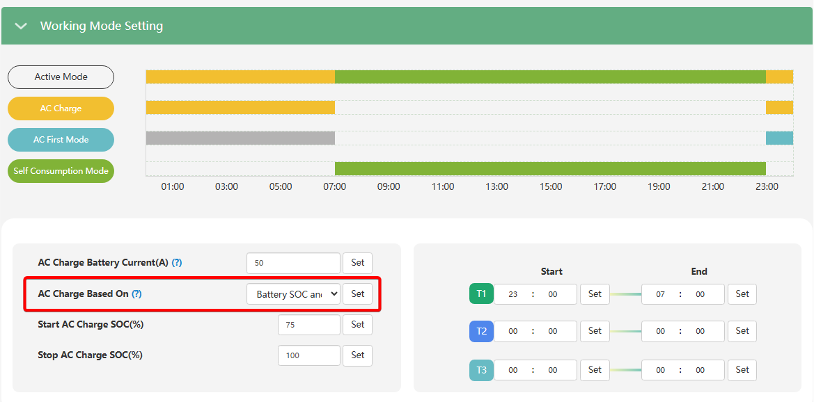

# AC Charge Based On

## Призначення

Цей параметр відповідає за вибір логіки (умови), згідно з якою інвертор примусово заряджатиме акумуляторну батарею від загальної електромережі (AC Grid). Дозволяє гнучко налаштувати зарядку за розкладом, за рівнем розряду, або за комбінацією цих умов.

## Доступ

| installer web | end-user web | mobile app | Display |
| :-----------: | :----------: | :--------: | :-----: |
|      ✅       |      ?       |     ?      |  ✅14   |

## Діапазон значень

Вибір із фіксованих режимів:

- **`Disable`:** Зарядка від мережі повністю вимкнена (За замовчуванням).
- **`Time (According to)`:** Зарядка виключно за заданим розкладом часу. Протягом цього часового вікна батарея заряджатиметься (до 100% або до встановленого ліміту напруги)
- **`Battery Voltage (According to)`:** Зарядка за рівнем напруги батареї. Aктивується, коли напруга падає нижче `Start AC Charge  Volt`, і зупиняється при досягненні `Stop AC Charge Volt`
- **`Battery SOC (According to)`:** Зарядка за відсотком заряду (SOC). Aктивується, коли рівень заряду падає нижче `Start AC Charge SOC`, і зупиняється при досягненні `Stop AC Charge SOC`
- **`Battery Voltage and Time (According to)`** Комбінація: зарядка за напругою, але тільки у вказаний час.
- **`Battery SOC and Time (According to)`** Комбінація: зарядка за відсотком заряду, але тільки у вказаний час.

## Рекомендовані значення

- `Disable`: якщо ви маєте достатньо сонячної генерації і примусова зарядка від мережі вам не потрібна.
- `Time (According to)`: якщо у вас є нічний (дешевий) тариф і ви хочете щоночі заряджати батарею до 100%, щоб вдень використовувати її енергію.
- `Battery SOC (According to) або Voltage`: якщо хочете утримувати рівень заряду на потрібному рівні. Наприклад, ви встановлюєте старт на 30% і зупинку на 50%.
- `Battery SOC and Time (According to) або Voltage and Time`: якщо хочете утримувати рівень заряду на потрібному рівні у визначений час.

## Коли змінювати

- Використовуйте логіку `SOC` для літієвих батарей (Li-ion, LiFePO4) з підключеним кабелем комунікації до інвертора.
- Використовуйте логіку `Voltage` для свинцево-кислотних, гелевих (AGM/GEL) акумуляторів, або для літієвих збірок, у яких BMS не підключена кабелем комунікації до інвертора.

## Налаштування з дисплею

Так. На РК-дисплеї інверторів серії SNA це налаштування знаходиться під індексом **14**. На екрані воно дозволяє вибрати базові режими: `DIS` (Вимкнено), `TIM` (За часом), `VOL` (За напругою) та `SOC` (За відсотком). Проте, розширені комбіновані умови (одночасно за часом і SOC/напругою) найзручніше налаштовувати саме через веб-моніторинг або додаток LuxCloud у розділі Charge Setting.

## Примітки

> [!WARNING] Розряд після заряду
> Якщо під час активного `AC Charge` часовий проміжок `AC First` буде неактивним, то при управлінні по SOC чи напрузі при досягненні кінцевого рівня SOC чи напруги, інвертор почне розряджати батарею поки вона не досягне початкового рівня SOC чи напруги для заряду від мережі. Якщо в період AC Charge ви не бажаєте щоб батарея починала розряджатись після заряду, активуйте такий самий часовий проміжок `АС First`.

> [!NOTE] Залежні параметри
> Вибір режиму в цьому випадному списку — це лише активація логіки. Щоб зарядка фактично запрацювала, вам потрібно задати відповідні пороги старту/зупинки (`Start AC Charge SOC/Volt` та `Stop AC Charge SOC/Volt`), встановити хочаб один з часових проміжків (`Time 1, Time 2, Time 3`), якщо обрано режим із часом, а також вказати максимальний струм заряду від мережі у параметрі `AC Charge Battery Current`.
