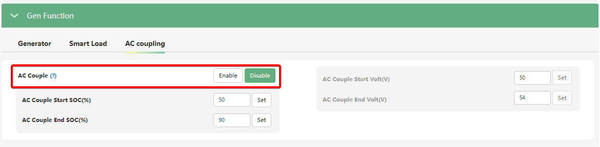
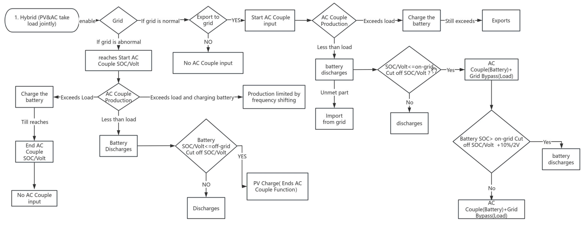
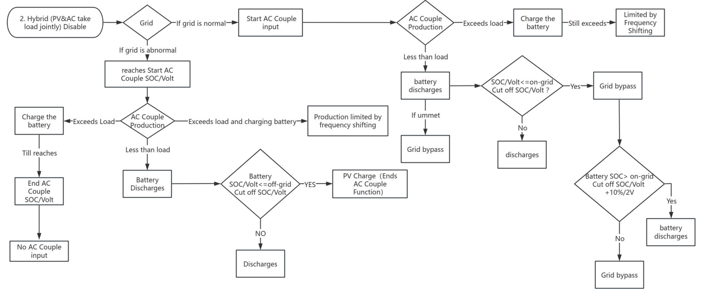

# AC Couple (Підключення мережевого інвертора)

## Призначення

Ця функція дозволяє перетворити вхідний порт генератора (GEN) на спеціальний порт для підключення **існуючого мережевого (On-Grid) сонячного інвертора**.

Використання режиму `AC Couple` дозволяє мережевому інвертору стати частиною повноцінної гібридної системи зберігання енергії. Мережевий інвертор підключається безпосередньо до GEN порту інвертора SNA6000. Енергія, яку генерує мережевий інвертор, буде використовуватися для живлення навантаження вашого будинку, надлишок піде на заряджання акумуляторів або може продаватися в зовнішню мережу (за Зеленим тарифом або Net Billing).

## Доступ

| Installer Web | End-User Web | Mobile App | Display (LCD) |
| :-----------: | :----------: | :--------: | :-----------: |
|      ✅       |      ?       |     ?      |     ✅ 32     |

_(На РК-дисплеї інвертора головний перемикач та налаштування порогів знаходяться в меню **32**)._

## Діапазон значень (Пов'язані параметри)

- **AC Couple:** `Enable` (Увімкнено) / `Disable` (Вимкнено).
- **[`AC Couple Start SOC(%) / Volt(V)`](ac_couple_start_stop):** Рівень заряду / напруги батареї (наприклад, 50%), при падінні до якого LuxPower увімкне мережевий інвертор під час роботи в автономному режимі (Off-Grid).
- **[`AC Couple End SOC(%) / Volt(V)`](ac_couple_start_stop):** Рівень заряду / напруги батареї (наприклад, 90%), при досягненні якого LuxPower дасть команду на вимкнення мережевого інвертора в автономному режимі (щоб уникнути перезаряду).

## Логіка роботи

Робота системи кардинально відрізняється залежно від наявності міської мережі:

1. **Мережа присутня (On-Grid)**: Тут логіка залежить від налаштування `PV&AC Take Load Jointly`:
   - 👉 **Якщо [`PV&AC Take Load Jointly`](pv_ac_take_load_jointly) УВІМКНЕНО**: Ви обов'язково повинні увімкнути функцію [`Export to Grid`](export_to_grid). Тільки тоді порт AC Couple запуститься
     . Енергія піде на живлення будинку та батареї, а весь надлишок буде експортуватися в міську мережу
     . Якщо експорт заборонити — порт не запуститься взагалі
     
   - 👉 **Якщо [`PV&AC Take Load Jointly`](pv_ac_take_load_jointly) ВИМКНЕНО (Базовий режим)**: Порт AC Couple запуститься навіть без дозволу на експорт в мережу. Енергія піде на навантаження резервної лінії (EPS) та заряджання батареї, а всі надлишки будуть автоматично "зрізатися" за допомогою функції зсуву частоти (Frequency Shifting)
     

2. **Мережа відсутня (Off-Grid / Блекаут):**
   LuxPower створює свою власну "віртуальну мікромережу" (Micro-Grid) на порту GEN. Мережевий інвертор "бачить" цю мережу, синхронізується з нею і починає генерувати енергію. Ця енергія живить ваші резервні прилади (на порту EPS) та заряджає батарею.

## Примітки та критичні вимоги

> [!WARNING] ОБОВ'ЯЗКОВО: Frequency Shifting (Зсув частоти):
> Для безпечної роботи в автономному режимі (Off-Grid) ви **повинні активувати функцію "Frequency Response Function" (Active power response to overfrequency / Зниження потужності при підвищенні частоти)** у налаштуваннях _самого підключеного мережевого інвертора_.
> Коли акумулятор LuxPower повністю зарядиться і надлишок енергії нікуди буде дівати, SNA6000 почне плавно підвищувати частоту своєї "віртуальної мережі" (наприклад, з 50.0 Гц до 51.0 Гц або вище). Мережевий інвертор, відчувши підвищення частоти, повинен плавно зменшити свою генерацію або повністю зупинитися.

> [!TIP] Лайфхак для автономного режиму:
> Щоб мережевий інвертор не вимикався (за умови що мережевий інвертор підтримує Frequency Shifting), а постійно підтримував генерацію під час блекауту (регулюючи її зсувом частоти), можна встановити параметр [`AC Couple Start SOC`](ac_couple_start_stop) на рівні 101%, або [`AC Couple Start Volt`](ac_couple_start_stop) — на недосяжно високе значення.

> [!WARNING] Заборона паралельного підключення:
> Функції порту (Генератор, Smart Load, AC Coupling) є взаємовиключними. Якщо порт налаштовано в режим `AC Couple`, до нього **категорично заборонено** підключати паливний генератор. Це призведе до пошкодження обладнання через зіткнення двох джерел струму.

## Коли змінювати:

Вмикайте та налаштовуйте цей режим виключно тоді, коли ви робите модернізацію об'єкта, де вже встановлена робоча мережева сонячна станція (що підтримує регулювання через сзув частоти). Це дозволить вам додати до неї резервне живлення за допомогою інвертора та акумуляторів LuxPower без необхідності перепідключати сонячні панелі (PV) від старого інвертора до нового.
