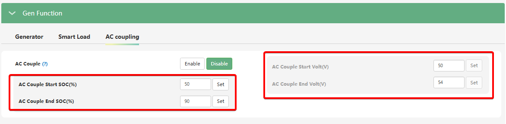

# AC Couple Start SOC(%) / Volt(V) та AC Couple End SOC(%) / Volt(V)

## Призначення

Ці дві пари параметрів працюють разом і визначають "робоче вікно" рівня заряду батареї (або напруги), в межах якого інвертор LuxPower SNA6000 дозволяє працювати підключеному мережевому інвертору (AC Coupled inverter) **в автономному режимі (Off-Grid)**.

## Доступ

| Installer Web | End-User Web | Mobile App | Display (LCD) |
| :-----------: | :----------: | :--------: | :-----------: |
|      ✅       |      ?       |     ?      |     ✅ 32     |

_(На РК-дисплеї ці параметри налаштовуються у меню **32**, як підпункти увімкнення функції AC Couple)_.

## Діапазон значень та налаштування за замовчуванням

Вибір між `SOC` (відсотками) та `Volt` (напругою) залежить від того, чи має ваша батарея сумісну CAN/RS485 комунікацію з інвертором.

**Пороги увімкнення генерації (AC Couple Start):**

- **SOC (%):** 0% – 101%. (За замовчуванням: **50%**).
- **Volt (V):** 40.0 В – 59.0 В. (За замовчуванням: **50.0 В**).

**Пороги вимкнення генерації (AC Couple End):**

- **SOC (%):** 0% – 101%. (За замовчуванням: **90%**).
- **Volt (V):** 40.0 В – 59.0 В. (За замовчуванням: **54.0 В**).

## Логіка роботи в автономному режимі (Блекаут)

1. **Запуск генерації (Start):** Якщо мережа зникла, а рівень заряду батареї впав до або нижче значення `AC Couple Start SOC` (наприклад, 50%), SNA6000 створює свою стабільну мікромережу. Мережевий інвертор синхронізується з нею, вмикається і починає живити будинок та заряджати батарею.
2. **Вимкнення генерації (End):** Як тільки рівень заряду батареї досягне верхнього порогу `AC Couple End SOC` (наприклад, 90%), SNA6000 підніме частоту своєї мікромережі. Мережевий інвертор, відчувши підвищення частоти, зменшить генерацію і повністю вимкнеться, припинивши заряджати батарею.
3. **Циклічність:** Коли після вимкнення мережевого інвертора будинок розрядить батарею знову до 50% (порогу Start), SNA6000 поверне частоту до 50.0 Гц, і мережевий інвертор увімкнеться знову.

## Примітки та важливі особливості для інсталяторів

> [!NOTE] Ігнорування за наявності міської мережі (On-Grid):
> Коли міська електромережа присутня, пороги `AC Couple Start SOC` та `AC Couple End SOC` не використовуються. Мережевий інвертор працює постійно: енергія йде на навантаження і заряджання АКБ, а будь-який надлишок експортується в загальну мережу (якщо експорт дозволено) або плавно обмежується функцією зсуву частоти (якщо гібридний режим `PV&AC Take Load Jointly` вимкнено)

> [!TIP] Як уникнути постійного вмикання/вимикання мережевого інвертора:
> Для того щоб підтримувати роботу мережевого інвертора в автономному режимі постійно (без жорстких вимкнень), виробник рекомендує встановити AC Couple Start SOC на рівні 101%, або Start Volt — на недосяжно високе значення. У такому разі SNA6000 не буде "вимикати" мережевий інвертор, а лише плавно "душитиме" його потужність за допомогою зсуву частоти, балансуючи генерацію під потреби будинку.

## Коли змінювати:

Коли потрібно розширити чи звузитии пороги батареї за яких буде працювати мережевий інвертор в режимі AC Couple.
