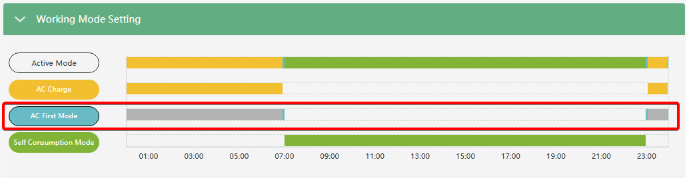

# AC First Mode

###### (Пріоритет мережі / Робота від мережі)

## Призначення

Цей режим дозволяє задати 3 часові проміжки, протягом яких інвертор примусово змінює базовий пріоритет роботи системи на пріоритет мережі. Основна мета — використовувати зовнішню міську мережу (AC Grid) для живлення навантаження, зберігаючи заряд акумулятора та дозволяючи всій доступній сонячній енергії першочергово заряджати батареї.

## Логіка роботи (USB/SBU/SUB)

Режим працює за часовим розкладом і перекриває базовий робочий режим інвертора (`Self Consumption Mode`) на час своєї дії.

### 1. Під час дії заданого часу (Активний пріоритет USB)

У межах встановленого вікна (наприклад, Time 1) інвертор працює за логікою **USB (Utility ➔ Solar ➔ Battery)**:

- **U (Utility / Мережа):** Міська мережа стає джерелом номер один. Інвертор перемикає живлення всього будинку на мережу (фактично працює в режимі Bypass).
- **S (Solar / Сонце):** Вся сонячна енергія вилучається з пріоритету живлення будинку і спрямовується _виключно_ на заряджання акумулятора. (Якщо ж сонячної енергії більше, ніж потрібно для заряду, надлишок долучиться до мережі для живлення навантаження).
- **B (Battery / Батарея):** Батарея знаходиться в режимі очікування або заряду.

### 2. Поза межами заданого часу (Повернення до базових пріоритетів SBU або SUB)

Щойно час дії `AC First` закінчується, інвертор автоматично повертається до того режиму, який був налаштований як основний:

- **Повернення до SBU (Solar ➔ Battery ➔ Utility):** Це стандартний сценарій (режим `Self Consumption Mode`). Спочатку будинок живиться від Сонця, нестача перекривається розрядом Батареї, поки її SOC є вищим порогу переходу на мережу `On-Grid Cut-Off SOC(%)`.
- **Повернення до SUB (Solar ➔ Utility ➔ Battery):** Цей сценарій активний, в наступний випадках:
  1. активовано примусовий розряд батареї (`Forced Discharge Enable`) але `Forced Discharge Power(kW)` виставлено на 0. Тоді Сонце живить будинок, нестача береться з AC мережі, а Батарея використовується лише як резерв на випадок знеструмлення (блекауту).
  2. В режимі `Self Consumption Mode` з активним `PV&AC Take Load Jointly`, коли SOC батареї знизився до `On-Grid Cut-off SOC` розряд батареї припиняється, і наваштаження починає живитись від мережі та сонця.

## Як налаштувати

Ви можете встановити до трьох незалежних часових проміжків ([Time 1, Time 2, Time 3](ac_first_t1_t2_t3)) для цього режиму.

- Для кожного проміжку задається `Start Time` (Час початку) та `End Time` (Час завершення).
- **Вимкнення режиму:** Якщо вам потрібно скасувати пріоритет мережі і дозволити системі працювати повністю автономно (наприклад, у постійному режимі SBU), встановіть для всіх трьох часових інтервалів значення `00:00` (Start: 00:00, End: 00:00).

## Примітки

> [!TIP] Багатотарифні лічильники (Day/Night Tariffs):
> Режим (USB) підходить для клієнтів із двозонними тарифами на електроенергію. Ви налаштовуєте `AC First` на нічні години. У цей час будинок живиться від дешевої мережі, а Батарея "відпочиває" і чекає ранку, щоб зарядитися від Сонця. Вдень режим вимикається, система переходить у класичний SBU, і будинок живиться від Сонця та накопиченої енергії Батареї, ігноруючи дорогий денний тариф.

> [!NOTE] Взаємодія та відмінність від режиму AC Charge:
> Важливо чітко розділяти логіку цих двох налаштувань:
>
> - Режим `AC First` лише перекладає живлення навантаження на мережу, але **не змушує** мережу заряджати акумулятор. Якщо ви хочете, щоб у цей час мережа ще й примусово заряджала АКБ, вам потрібно додатково налаштувати вікна заряду режиму `AC Charge`.
> - І навпаки: сам по собі режим `AC Charge` **не змушує** інвертор переходити на живлення будинку від мережі, якщо умови для старту заряду батареї (наприклад, `Charge Start SOC`) ще не досягнуті. Навіть під час дії часового вікна `AC Charge` за межами `AC First`, якщо батарея ще не потребує заряду, інвертор не перемикатиметься на мережу і продовжить живити навантаження від сонця та батареї у звичайному гібридному режимі.
