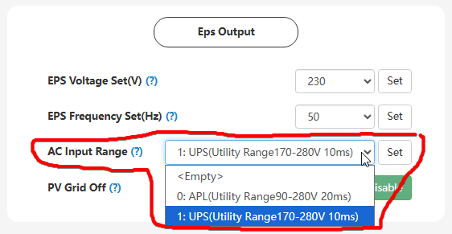

# AC Input Range

## Призначення

Цей параметр визначає допустимий діапазон вхідної напруги змінного струму (від зовнішньої мережі або генератора). Поки напруга в мережі залишається в цих межах, інвертор працює паралельно з нею (заряджає батарею і живить навантаження транзитом). Якщо напруга падає нижче або піднімається вище встановлених меж, інвертор відключається від зовнішньої мережі та переходить в автономний режим (резервне живлення від батареї/сонця)

## Доступ

| installer web | end-user web | mobile app | Display |
| :-----------: | :----------: | :--------: | :-----: |
|      ✅       |      🚫      |     🚫     |  ✅13   |

## Діапазон значень

Вибір із 2 фіксованих профілів:

- `UPS: від 170В до 280В 20ms`
- `APL: від 090В до 280В 10ms`

## Рекомендовані значення

- для стабільних мереж: `UPS`.
- для проблемних мереж: `APL`.
- За замовчуванням: `APL`

## Примітки

- **Час перемикання:** Від обраного профілю залежить не тільки діапазон напруги, але й час перемикання на резерв (Transfer Time).
  У режимі `UPS` **час перемикання становить 10 мс**. Це достатньо швидко, щоб комп'ютери, роутери та телевізори не встигли вимкнутися.
  У режимі `APL` інвертор намагається "витягнути" з мережі напругу аж до 90В, але через це **час перемикання збільшується до 20 мс**. При такому часі перемикання деяка чутлива електроніка (наприклад, ПК) може встигнути перезавантажитися.

- **Коли змінювати:** Змінюйте на APL, якщо у вас часто бувають просадки напруги (нижче 170 В), і ви не хочете, щоб інвертор щоразу перемикався в цей час на батарею.

> [!Note] Окрім цього налаштування інвертор керується обраним інсталятором стандартом мережі (Model Setting -> Rule), і якщо у стандарті будуть пороги вищі за нижній поріг (`APL`90В чи `UPS`170В), та нижчі за верхній поріг 280В, інвертор буде перемикатись на батарею згідно порогів визначених у стандарті мережі.
