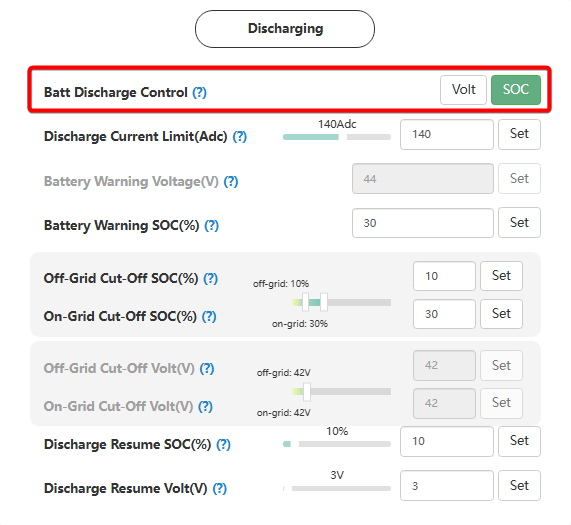

# Batt Discharge Control

##### Керування розрядом батареї

## Призначення

Цей параметр визначає, за яким саме критерієм інвертор буде контролювати глибину розряду акумулятора.

Він вказує системі, на які саме дані спиратися при прийнятті рішення про відключення розряду: на відсоток заряду (SOC), що передається від розумної плати керування (BMS) акумулятора, чи на фізичне вимірювання напруги (Вольти) на клемах інвертора.

## Доступ

| Installer Web | End-User Web | Mobile App | Display (LCD) |
| :-----------: | :----------: | :--------: | :-----------: |
|      ✅       |      ?       |     ?      |     ✅ 10     |

_(На РК-дисплеї інвертора це налаштування має назву **TEOd** і знаходиться під індексом **10**)._

## Діапазон значень

- **`SOC`** — керування за відсотком заряду.
- **`Voltage` / `VOLT`** — керування за напругою.

## Рекомендовані значення

вибір залежить від наявності комунікаційного кабелю:

- **Для літієвих батарей з кабелем комунікації (Closed-loop):** **`SOC`**. У цьому режимі інвертор використовує дані відсотка заряду, отриманих з BMS.
- **Для свинцево-кислотних, гелевих, AGM або літієвих "самозбірок" без кабелю комунікації:** **`Voltage`**. Оскільки інвертор не отримує даних від BMS і не знає точного відсотка заряду, він може орієнтуватися лише на напругу на клемах.

## Примітки та важливі обмеження

> [!WARNING] **Зміна одиниць виміру для порогів відключення:**
> Зверніть увагу, що ваш вибір у цьому меню автоматично змінить формат наступних критично важливих налаштувань: порогів відключення [`On-Grid Cut-Off SOC(%)`](/settings/on_grid_cut_off_soc) (розряд за наявності мережі) та [`Off-Grid Cut-Off SOC(%)`](/settings/off_grid_cut_off_soc) (розряд під час блекауту).
>
> - Якщо ви обрали `SOC`, інвертор вимагатиме ввести ці пороги у **відсотках** (наприклад, 15%).
> - Якщо ви обрали `Voltage`, пороги потрібно буде вказувати у **Вольтах** (наприклад, 44.0 В).

> [!NOTE] **Логічна відповідність до Battery Type:**
> Це налаштування має логічно відповідати обраному типу батареї. Якщо у [`Battery Type`](/settings/battery_type) ви обрали `Lithium` і налаштували протокол зв'язку, тут варто виставити `SOC` (але в окремих випадках можна використовувати і `Voltage`). Якщо ви обрали `Lead-acid` — система очікуватиме роботу за `Voltage`.

## Коли змінювати

Цей параметр налаштовується **одноразово** під час пусконалагоджувальних робіт, одразу після вибору типу акумулятора. У подальшому його потрібно змінювати лише у випадку фізичної заміни акумуляторного блоку (наприклад, якщо ви переходите зі старих свинцевих акумуляторів на сучасну літієву систему зі зв'язком).
