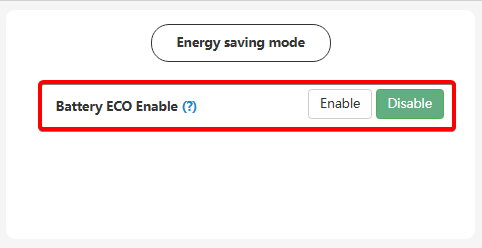

# Battery ECO Enable

## Призначення

Ця функція призначена для заощадження ресурсу акумулятора та запобігання його зайвим мікроциклам. Якщо її увімкнути, то коли акумулятор розрядиться до встановленого порогу відключення (`On-grid EOD`) і при цьому примусове заряджання від мережі (`AC Charge`) вимкнене, інвертор перейде в режим чистого транзиту (байпасу). Він повністю "відпустить" батарею і живитиме навантаження виключно від зовнішньої електромережі, чекаючи, доки не з'явиться достатньо сонячної енергії (PV) для заряджання, або доки не зникне зовнішня мережа (тоді він знову задіє батарею для резервного живлення будинку)

## Доступ

| installer web | end-user web | mobile app | Display |
| :-----------: | :----------: | :--------: | :-----: |
|      ✅       |      🚫      |     🚫     |  ✅ 20  |

## Діапазон значень

- Лише два стани: `Disable` (Вимкнено) та `Enable` (Увімкнено).

## Рекомендовані значення

- `Disable` (Вимкнено), особливо якщо для вас критично важлива максимальна швидкість перемикання на резервне живлення для чутливої електроніки.
- За замовчуванням: `Disable` (Вимкнено).

## Час перемикання

Увімкнення режиму `Battery ECO` впливає на швидкість реакції інвертора. Оскільки система "паркує" батарею, час перемикання на резерв при зникненні світла (Transfer Time) збільшується до 15 мілісекунд (**а іноді й довше**). Швидкості у 10 мс (як у режимі `UPS`) вже не буде, і деяка чутлива електроніка (наприклад, стаціонарні ПК) може встигнути перезавантажитися.

## Коли змінювати

Вмикайте, якщо хочете максимально зберегти ресурс акумулятора, і для вас не є проблемою трохи довший час перемикання на резерв під час блекаутів. В іншому випадку — залишайте вимкненою.
