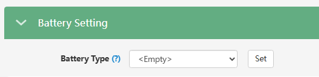

# Battery Type (Тип акумулятора)

## Призначення

Цей параметр є фундаментальним базовим налаштуванням інвертора. Він повідомляє системі, яке саме джерело накопичення енергії підключено (або що його немає взагалі). Від цього вибору кардинально змінюється вся подальша логіка роботи інвертора: чи буде він спиратися на відсотки (SOC) через розумну плату BMS, чи буде керувати зарядом/розрядом виключно за напругою (Вольтами), чи перейде в режим звичайного мережевого інвертора без резервування.

## Доступ

| Installer Web | End-User Web | Mobile App | Display (LCD) |
| :-----------: | :----------: | :--------: | :-----------: |
|      ✅       |      🚫      |     🚫     |     ✅ 03     |

_(На дисплеї інвертора це налаштування знаходиться під індексом **03** і є першим параметром, який рекомендується встановлювати під час монтажу)._

## Діапазон значень

Відповідно до архітектури моніторингу LuxPower та меню інвертора, параметр має три базові стани:

- **`0: No battery` (Без батареї):** Робота інвертора без акумулятора. Інвертор працює суто для передачі сонячної енергії в навантаження або генерації надлишків у мережу.
- **`1: Lead-acid` (Свинцево-кислотна):** Керування алгоритмами заряду та розряду здійснюється виключно за напругою (Volt).
- **`2: Lithium` (Літієва):** Керування відбувається відповідно до даних комунікації (BMS) по стану заряду (SOC) або напрузі (Volt).

## Рекомендовані значення

- **Для сучасних батарей з комунікацією (Pylontech, Deye, Dyness, HinaESS, LuxPower тощо):** Виключно **`2: Lithium`**.
- **Для старих свинцевих, AGM, гелевих АКБ, АБО для "самозбірок" на літії без кабелю комунікації CAN/RS485:** Виключно **`1: Lead-acid`**. _Навіть якщо у вас літій, але інвертор з ним не спілкується кабелем — обирайте Lead-acid, щоб мати змогу налаштувати пороги розряду у Вольтах._ У прошивці cBaa-338F99 додали можливість вибору `2: Lithium` для літієвих батарей (15S тa 16S) без комунікації, але поки не зрозуміло наскільки стабільно працюють ці нові опції.
- **Якщо система працює суто як мережевий інвертор:** **`0: No battery`**.

## Примітки та важливі обмеження

> [!WARNING] Обов'язковий вибір бренду (Battery Brand):
> Якщо ви обрали тип `Lithium`, наступним і обов'язковим кроком є вибір протоколу комунікації — **Battery Brand**. Наприклад, для батарей Pylontech це протокол `2`, для LuxPower (або сумісних) — `6`, для HinaESS — `1`. Якщо не обрати правильний бренд, звязок між батареєю та інвертором може бути нестабільним, або взагалі відсутнім, інвертор не зможе отримати дані від батареї та видасть помилку зв'язку з BMS (Warning 00).

> [!NOTE] Налаштування ємності для свинцю:
> Якщо ви обрали тип `Lead-acid`, вам обов'язково потрібно вручну вказати загальну ємність вашого акумуляторного масиву в Ампер-годинах (Battery Capacity). Це необхідно для того, щоб інвертор міг розраховувати стан заряду (SOC).

> [!TIP] Перезавантаження при зміні типу:
> При виборі типу `Lithium` та встановленні бренду батареї інвертор автоматично вимкнеться та увімкнеться знову (перезавантажиться) для застосування нових протоколів зв'язку. Це нормальна поведінка інвертора при збереженні таких параметрів.

> [!WARNING] Використання несумісних літієвих батарей:
> Якщо вашої літієвої батареї немає в офіційному списку сумісності, LuxPower може відмовити вам у гарантії на інвертор.

## Коли змінювати

Це налаштування виконується **один раз під час першого запуску (пусконалагодження)** системи. У подальшому воно змінюється лише у випадку, якщо ви фізично замінили тип акумуляторного блоку на об'єкті (наприклад, перейшли зі свинцево-кислотних АКБ на літієві з комунікацією).
