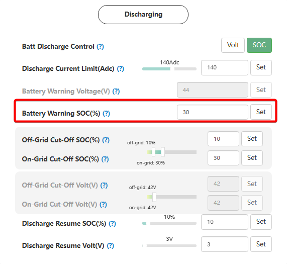

# Battery Warning SOC (%)

## Призначення

Цей параметр визначає поріг рівня заряду акумуляторної батареї (у відсотках), при зниженні до якого інвертор генерує попередження про низький рівень заряду (на дисплеї та в моніторингу з'являється код **Warning 26: Battery low**).

Як і у випадку з напругою, досягнення цього відсотка **не зупиняє розряд акумулятора**. Інвертор продовжить живити підключені побутові прилади, поки заряд не впаде до критичного порогу відключення ([`Off-grid Cut-off SOC`](/settings/off_grid_cut_off_soc) або [`On-grid Cut-off SOC`](/settings/on_grid_cut_off_soc)). Цей параметр слугує виключно як завчасне сповіщення для користувача (щоб вимкнути зайві навантаження) та як системна команда для автоматичного запуску генератора.

## Доступ

| Installer Web | End-User Web | Mobile App | Display (LCD) |
| :-----------: | :----------: | :--------: | :-----------: |
|      ✅       |      ?       |     ?      |     ✅ 34     |

_(На РК-дисплеї інвертора цей параметр об'єднаний із налаштуванням за напругою, знаходиться під індексом **34** і має назву `Bat Warning Value Setting Volt/SOC`)._

## Діапазон значень

- **Мінімум:** Дорівнює встановленому вами порогу відключення [`Off-grid Cut-off SOC`](/settings/off_grid_cut_off_soc).
- **Максимум:** 90%.
- **Крок:** 1%.
- **За замовчуванням:** 20%.

## Рекомендовані значення

- Зазвичай встановлюється на **5% – 10% вище** за ваш поріг відключення ([`Off-grid Cut-off SOC`](/settings/off_grid_cut_off_soc)). Наприклад, якщо інвертор вимикається при 15%, логічно встановити попередження на 20% або 25%. Це дасть вам певний запас часу (і ємності) для реакції.

## Примітки та важливі особливості

> [!NOTE] **Залежність від типу керування розрядом:**
> Цей параметр активний лише тоді, коли розряд керується за відсотком заряду ([`Batt Discharge Control`](/settings/batt_discharge_control) встановлено на `SOC`). Тобто, це налаштування працює для літіевих батарей з підключеним кабелем комунікації (BMS). Якщо комунікації немає, інвертор орієнтуватиметься на сусідній параметр у Волтах.

> [!WARNING] **Головний тригер для запуску генератора (Dry Contact):**
> Це налаштування є важливим, якщо у вас інвертор працює в парі з генератором з функцією автозапуску (ATS). При відключенні зовнішньої мережі, як тільки рівень заряду (SOC) падає до значення `Battery Warning SOC`, інвертор замикає реле сухого контакту, подаючи генератору сигнал на запуск.

> [!TIP] **Звуковий сигнал:**
> Досягнення цього порогу може супроводжуватися звуковим сигналом інвертора (піканням), якщо в меню 34 (на дисплеї) додатково увімкнено опцію `Bat low Buzzer Enable`.

## Коли змінювати:

Налаштовуйте цей параметр, якщо ви хочете отримувати сповіщення (Push-повідомлення в додатку LuxCloud) про розряд батареї.
Також коригуйте це значення при налаштуванні системи автозапуску генератора: встановіть тут той відсоток заряду, при якому ви хочете, щоб генератор завівся і почав примусово заряджати вашу розряджену батарею під час блекауту.
