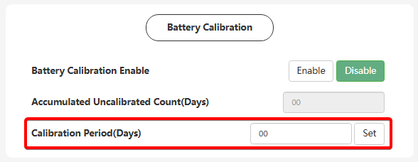

# Calibration Period (Days)

## Призначення

Цей параметр встановлює циклічність (інтервал у днях), з якою інвертор має проводити автоматичний калібрувальний заряд акумуляторної батареї.

Він працює у прямій зв'язці з функцією [`Battery Calibration Enable`](/settings/battery_calibration_enable) та інформаційним лічильником [`Accumulated Uncalibrated Count`](/settings/accumulated_uncalibrated_count_days). Параметр повідомляє системі: _"Якщо батарея не заряджалася до повних 100% протягом Х днів, зроби це примусово вночі"_. Це необхідно для того, щоб вбудовані балансири BMS мали змогу вирівняти комірки та усунути дрейф відсотків (SOC).

## Доступ

| Installer Web | End-User Web | Mobile App | Display (LCD) |
| :-----------: | :----------: | :--------: | :-----------: |
|      ✅       |      ?       |     ?      |       ?       |

## Діапазон значень

- **Мінімум:** 0 днів.
- **Максимум:** 255 днів.
- **Крок:** 1 день.
- **За замовчуванням:** 14 днів.

## Рекомендовані значення

- **Оптимальне значення:** `14 днів` (значення за замовчуванням). Це добрий старт, який забезпечить, що батарея балансуватиметься як мінімум двічі на місяць, підтримуючи точність розрахунку SOC BMS. В залежності від вираженості ефекту зміщення SOC для вашої BMS підберіть оптимальне для вас значення, якщо 14 днів вас не влаштовують.

## Логіка роботи та взаємодія

1. Інвертор постійно відстежує, скільки днів минуло з останнього повного заряду батареї (цей час відображається у полі [`Accumulated Uncalibrated Count`](/settings/accumulated_uncalibrated_count_days)).
2. Як тільки значення `Accumulated` стає рівним або перевищує значення, встановлене вами в `Calibration Period (Days)`, спрацьовує системний тригер.
3. Якщо функцію [`Battery Calibration`](/settings/battery_calibration_enable) увімкнено (`Enable`), інвертор дочекається нічного вікна (між 00:00 та 05:00) та почне примусово заряджати батарею від мережі доки вона не досягне 99% + 1 година утримання, або доки сама BMS не зупинить заряд на 5 секунд.
4. Після успішного калібрування лічильник скидається на 0 і цикл починається знову.

## Примітки та важливі обмеження

> [!NOTE] Природне калібрування від сонця:
> Якщо у вас був сонячний день і батарея зарядилася до 100% від сонячних панелей, лічильник днів обнулиться автоматично. У такому разі примусове калібрування від мережі вночі не запускатиметься.

> [!WARNING] Головний перемикач має бути увімкнений:
> Навіть якщо ви встановите тут 7 чи 14 днів, процес калібрування не запуститься, якщо загальний перемикач [`Battery Calibration Enable`](/settings/battery_calibration_enable) знаходиться у стані `Disable`.

## Коли змінювати:

- **Залишайте 14 днів** для більшості стандартних інсталяцій — це забезпечить стабільну роботу і відсутність скарг клієнтів на різкі "стрибки" SOC.
- **Зменшуйте до 7 днів**, якщо ви працюєте з бюджетними літієвими батареями, які схильні до дуже швидкого розбалансування комірок, або в даній моделі бмс спостерігається виражений ефект "дрейфу" SOC.
- **Збільшуйте до 20 днів (або більше)**, якщо об'єкт повністю автономний (Off-Grid) з живленням від генератора, і ви хочете суворо обмежити частоту примусових запусків генератора суто для балансування.
