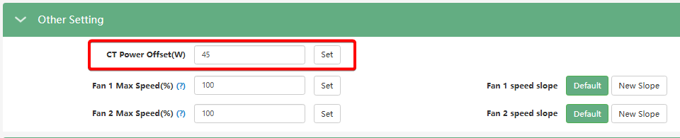

# CT Power Offset(W)

###### (Калібрування трансформатора струму)

## **Призначення**

Датчик струму має похибку приблизно +-100Вт. Буває так, що інвертор показує 0Вт на сторінці моніторингу, а мережевий лічильник при цьому показує споживання або віддачу в мережу. В такому випадку можна підкоригувати зсув датчика. Якщо ввести +50, інвертор буде віддавати в мережу на 50Вт більше, компенсуючи споживання. Якщо ввести -50, то навпаки - зменшить віддачу на 50Вт.

## **Доступ**

|   Installer Web   | End-User Web | Mobile App | Display (LCD) |
| :---------------: | :----------: | :--------: | :-----------: |
| ✅(old page only) |      ?       |     ?      |     ✅ 24     |

_(На РК-дисплеї інвертора налаштування зсуву CT знаходиться в меню **24**).
У web інтерфейсі станом на 04.2026 доступне **лише зі старої сторінки налаштувань**_

## **Діапазон значень**

- **Діапазон:** зазвичай від -199 Вт до +199 Вт (в деяких прошивках від -200 Вт до 200 Вт),.
- **Значення за замовчуванням:** 0 Вт.
- **Від'ємне значення (Negative offset):** Змушує інвертор постійно підтримувати невелике фонове споживання з мережі (імпорт), щоб гарантовано запобігти несанкціонованому "витоку" електроенергії назовні.
- **Додатне значення (Positive offset):** Допомагає компенсувати постійне фонове споживання з мережі, якщо система бере з неї більше, ніж потрібно для нульового балансу.

## **Рекомендовані значення**

- Якщо в режимі нульового експорту ("Zero Export") система моніторингу або вхідний лічильник електромережі все одно фіксує невелику віддачу енергії в мережу, встановіть від'ємне значення, наприклад, **-50 Вт**.
- Якщо система постійно споживає зайву енергію з мережі, коли має бути нульове споживання і вистачає сонця/батареї, встановіть додатне значення, наприклад, **+50 Вт**.

## **Логіка роботи та важливі обмеження**

> [!WARNING] Робота з чутливими лічильниками мережі:
> Ця функція є корисною, якщо у клієнта встановлено чутливий вхідний лічильник електроенергії (який може "вибивати" або блокуватися при найменшому виявленні генерації в мережу). Встановлення зсуву в мінусове значення дозволяє створити "буфер" споживання і уникнути спрацювання лічильника через випадкові мікро-експорти.
