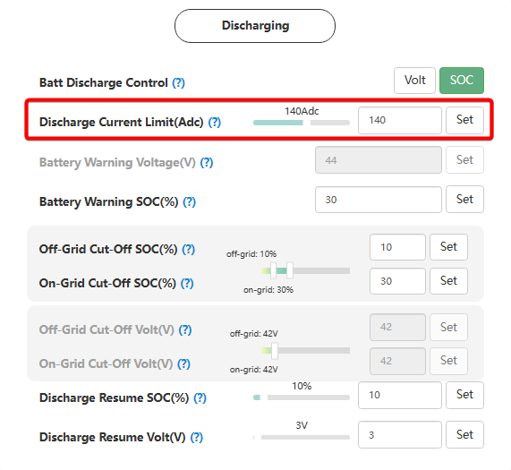

# Discharge Current Limit (Adc / A)

## Призначення

Цей параметр (на РК-дисплеї позначається як **Id: Maximum discharge current**) встановлює максимально допустимий струм (в Амперах), яким інвертор може розряджати акумуляторну батарею для живлення ваших побутових приладів або для експорту в мережу.

## Доступ

| Installer Web | End-User Web | Mobile App | Display (LCD) |
| :-----------: | :----------: | :--------: | :-----------: |
|      ✅       |      ?       |     ?      |     ✅ 09     |

_(На дисплеї інвертора загальний ліміт струму розряду знаходиться під індексом **09**)._

## Діапазон значень

- **Мінімум:** 0 А.
- **Максимум:**
  - Для моделі SNA5000: 110 А.
  - Для моделі SNA6000: 140 А.
- **Крок:** 1А.
- **За замовчуванням:** Максимально можливий струм для вашої моделі (110 А або 140 А).

## Рекомендовані значення

- **Для свинцево-кислотних, гелевих та AGM АКБ:** Щоб акумулятор прослужив довго і не деградував від глибоких просадок, струм розряду не повинен перевищувати **0.1C – 0.2C** (де C — номінальна ємність). Наприклад, для масиву на 200Ah безпечним лімітом розряду буде 20 А – 40 А.
- **Для сучасних літієвих батарей (LiFePO4):** Більшість виробників рекомендують номінальний струм розряду на рівні **0.5C** (наприклад, 50 А для батареї 100Ah). Якщо у вас підключено декілька батарей паралельно, цей ліміт можна відповідно збільшити.

## Примітки та важливі обмеження

> [!WARNING] Підпорядкування командам BMS (для літієвих АКБ з комунікацією):
> Як і у випадку із зарядом, якщо інвертор зв'язаний з батареєю кабелем комунікації, він постійно зчитує параметр DCL (Discharge Current Limit) безпосередньо з плати BMS. Інвертор **ніколи не перевищить** ліміт, який дозволяє сама батарея, навіть якщо ви встановите тут 110 А, а BMS дозволяє лише 50 А.

> [!NOTE] Вплив на роботу системи (On-Grid та Off-Grid):
>
> - **За наявності мережі (On-Grid):** Якщо ваш будинок споживає більше струму, ніж дозволено цим лімітом розряду, інвертор просто "дотягне" нестачу потужності з міської електромережі.
> - **Під час блекауту (Off-Grid):**
>   - **У випадку батарей з комунікацією**: інвертор спиратиметься на ліміт від BMS, навіть якщо в `Discharge Current Limit` виставлене менше значення ніж дозволяє BMS. Тобто без мережі цей параметр ігнорується.
>   - **У випадку батарей БЕЗ комунікації** при перевищенні `Discharge Current Limit` можливе вимкнення виходу інвертора з попередженням (Warning 28: EPS Overload), щоб захистити батарею від надмірного струму.

## Коли змінювати:

- Налаштовуйте цей параметр під час першого запуску відповідно до дозволеного струму розряду вашої батареї.
