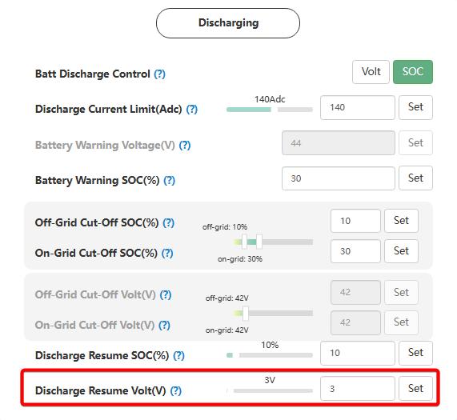

# Discharge Resume Volt (V)

## Призначення

Цей параметр виконує функцію гістерезису для систем, де керування розрядом відбувається за напругою.

Він визначає, на скільки Вольт (V) напруга акумулятора повинна піднятися **вище** встановленого порогу відключення, щоб інвертор знову дозволив розряджати батарею (живити будинок). Головна мета цієї функції — запобігти частому (циклічному) перемиканню реле інвертора між режимами заряду та розряду.

Без цього буфера, як тільки інвертор вимкне навантаження при 47.0 В, напруга свинцевої батареї миттєво "підстрибне" до 48.0 В (через відсутність навантаження), інвертор знову увімкне розряд, напруга знову просяде до 47.0 В, і цикл повторюватиметься нескінченно.

## Доступ

| Installer Web | End-User Web | Mobile App | Display (LCD) |
| :-----------: | :----------: | :--------: | :-----------: |
|      ✅       |      ?       |     ?      |       ?       |

## Діапазон значень

- **Мінімум:** ? В.
- **Крок:** 1 В.
- **За замовчуванням:** ? В.

## Рекомендовані значення

- **Оптимально для свинцево-кислотних / гелевих АКБ:** `? В - ? В`. Свинцеві батареї мають високий внутрішній опір і значний ефект "відскоку" напруги (voltage bounce). Ширший буфер гарантує, що система відновить роботу лише тоді, коли батарея дійсно накопичить заряд від сонця чи мережі.
- **Для літієвих "самозбірок" (керування за напругою):** `? В - ? В`. Літій має жорсткішу криву напруги, тому занадто великий буфер тут не потрібен.

## Логіка роботи

Формула відновлення розряду виглядає так:
`Точка відновлення = Поріг відключення + Discharge Resume Volt (V)`.

**Приклад роботи:**
Якщо ваш поріг відключення без мережі ([`Off-Grid Cut-Off Volt`](/settings/off_grid_cut_off_volt)) встановлено на **47.0 В**, а буфер `Discharge Resume Volt` встановлено на **2.0 В**:

1. Інвертор зупинить розряд (вимкне живлення будинку), коли напруга під навантаженням впаде до 47.0 В.
2. Напруга батареї на холостому ходу одразу підніметься (наприклад, до 48.0 В), але інвертор **не відновить** живлення будинку.
3. Живлення на будинок буде подано лише тоді, коли сонце або генератор зарядять батарею мінімум до **49.0 В** (47.0 В + 2.0 В).

## Примітки та важливі деталі

> [!NOTE] Спільне використання для всіх порогів:
> цей параметр є глобальним гістерезисом. Він застосовується одразу до кількох налаштувань: до порогу відключення без мережі ([`Off-grid Cut-off Volt`](/settings/off_grid_cut_off_volt)), до порогу переходу на мережу ([`On-grid Cut-off Volt`](/settings/on_grid_cut_off_volt)), а також до порогу відновлення після попередження про низький заряд (`Battery low warning point`).

## Коли змінювати:

Збільшуйте це значення, якщо ви використовуєте свинцево-кислотні АКБ і помітили, що під час відключення світла інвертор "клацає", циклічно вмикаючи та вимикаючи живлення будинку через сильні просадки та відскоки напруги батареї. Якщо ви використовуєте літієві батареї в режимі Voltage і хочете, щоб світло з'являлося швидше після початку сонячного дня, зменшіть це значення.
