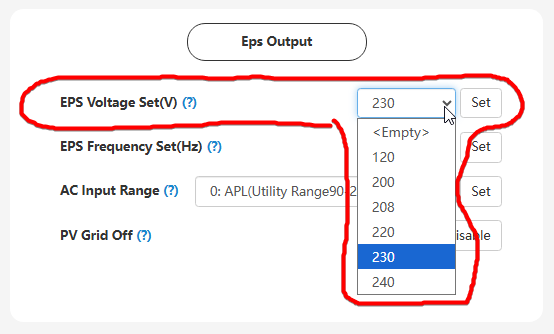

# EPS Voltage Set(V)

## Призначення

Цей параметр відповідає за встановлення рівня вихідної напруги змінного струму (AC) на порту резервного живлення, коли інвертор працює в автономному режимі (Off-grid) під час відключення зовнішньої електромережі, або в режимі [`Self Consumption Mode`](self_consumption) при наявній зовнішній мережі але відключеному [`PV&AC Take Load Jointly`](pv_ac_take_load_jointly).

## Доступ

| installer web | end-user web | mobile app | Display |
| :-----------: | :----------: | :--------: | :-----: |
|      ✅       |      🚫      |     🚫     |  ✅04   |

## Діапазон значень

- Мінімум: 120В (120Vac).
- Максимум: 240В (240Vac).

## Рекомендовані значення

- 230В (сучасний офіційний стандарт напруги для України та Європи).
- За замовчуванням: 230В (230Vac).

## Примітки

- **Важливі обмеження:** Це налаштування впливає на напругу на виході **тільки** під час відсутності загальної електромережі (блекаут) або роботи в автономному режимі з виключеним [`PV&AC Take Load Jointly`](pv_ac_take_load_jointly). Коли зовнішня AC мережа підключена та включене [`PV&AC Take Load Jointly`](pv_ac_take_load_jointly), інвертор працює в режимі транзиту (байпасу) і видає на резервне навантаження ту саму напругу, яка надходить із зовнішньої мережі.
- **Коли змінювати**: Змінювати це значення потрібно лише в тому випадку, якщо ви встановлюєте інвертор у країні з іншим стандартом мережі, або якщо у вас є специфічне чутливе обладнання, яке суворо вимагає живлення за старим стандартом (наприклад, рівно 220 В). Для абсолютної більшості випадків залишайте значення за замовчуванням.
