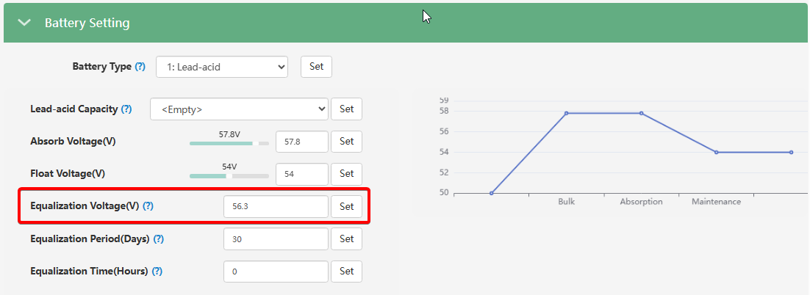

# Equalization Voltage(V)

###### (Напруга вирівнювання / Еквалізація)

## Призначення

Цей параметр визначає напругу для спеціального режиму обслуговування свинцево-кислотних акумуляторів — **вирівнювання (Equalization)**.

Еквалізація — це контрольований перезаряд батареї підвищеною напругою, який виконується періодично. Його головна мета — "перемішати" електроліт, вирівняти напругу на всіх послідовно з'єднаних комірках та зняти сульфатацію зі свинцевих пластин. Це дозволяє відновити ємність та подовжити термін служби акумуляторного масиву.

## Доступ

| Installer Web | End-User Web | Mobile App | Display (LCD) |
| :-----------: | :----------: | :--------: | :-----------: |
|      ✅       |      ?       |     ?      |      ✅       |

_(Налаштування доступне в розділі Battery Setting для свинцево-кислотних батарей)._

## Діапазон значень

- **Для свинцево-кислотних батарей (Lead-Acid):** від 50.0 В до 59.0 В.
- **Для літієвих батарей (в режимі Lead-Acid):** необхідно ввести **0** (щоб повністю вимкнути цю функцію).

## Рекомендовані значення

- **Батареї з рідким електролітом (Flooded) або трубчасті (OPzS):** Зазвичай потребують високої напруги вирівнювання (наприклад, 58.0 В – 59.0 В). Точне значення дивіться в паспорті АКБ.
- **Герметизовані батареї (AGM / GEL):** Більшість сучасних гелевих та AGM батарей **не потребують** еквалізації, оскільки висока напруга змусить їх "википіти". Для них цей параметр найчастіше не використовується або встановлюється на рівні напруги абсорбції (Absorb Voltage).
- **Літієві батареї (без комунікації):** **0 В**.

## Логіка роботи

Режим вирівнювання працює в парі з двома іншими налаштуваннями:

- `Equalization Period(Days)` (інтервал у днях, наприклад, кожні 30 днів) та
- `Equalization Time(Hours)` (тривалість, наприклад, 1 година).

Коли настає заданий день, інвертор після основного заряду піднімає напругу до рівня `Equalization Voltage`, утримує її заданий час (кондиціонуючи батарею), а потім повертається до звичайного підтримувального заряду (Float).

## Важливі обмеження

> [!WARNING] Увага для літію (Lithium in Lead-Acid mode):
> 👉 Якщо ви підключаєте літієву батарею без комунікації (наприклад, саморобну збірку) і використовуєте режим "Lead-Acid" (керування по напрузі), ви **встановіть `Equalization Voltage`, `Equalization Period(Days)` та `Equalization Time(Hours)` на 0**.

## Коли змінювати

- **Встановіть на 0**, якщо використовуєте літієвий акумулятор у режимі налаштувань для свинцю.
- Налаштовуйте цей параметр під час пусконалагодження системи з відкритими свинцево-кислотними батареями, попередньо звіривши напругу, періодичність (Interval) та час (Time) з технічною документацією заводу-виробника акумуляторів.
