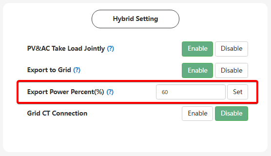

# Export Power Percent(%) (Відсоток експорту потужності)

## Призначення

Цей параметр визначає ліміт (у відсотках від номінальної потужності інвертора), з яким надлишкова сонячна енергія буде експортуватися (продаватися) у зовнішню міську мережу.

## Доступ

| Installer Web | End-User Web | Mobile App | Display (LCD) |
| :-----------: | :----------: | :--------: | :-----------: |
|      ✅       |      ✅      |     ?      |      ✅       |

## Діапазон значень

- **Діапазон:** від 0% до 250%.

## Логіка роботи

1. **Активація:** Параметр працює лише тоді, коли увімкнено `Export to Grid` та `PV&AC Take Load Jointly`.
2. **Значення 100%:** Дозволяє інвертору віддавати весь доступний надлишок енергії в мережу.
3. **Проміжні значення до 100% (наприклад, 50%):** Для інвертора потужністю 6 кВт встановлення 50% означатиме, що він віддаватиме в мережу не більше ніж 3 кВт надлишку.
4. **Значення від 100% до 250%:** Використовується коли в системі присутній інший генеруючий пристрій (наприклад, мережевий інвертор підключений до порту GEN у режимі `AC Couple`).

<!-- > [!NOTE] **Особливість роботи з AC Couple:**
> Згадайте наш перший розбір: встановлення `Export Power Percent(%)` на 0% блокує експорт **лише від власних сонячних панелей** гібридного інвертора LuxPower. Якщо у вас до порту GEN підключено сторонній мережевий інвертор (режим AC Couple), і система працює паралельно з міською мережею, LuxPower фізично не зможе стримати надлишки від цього мережевого інвертора, і вони все одно підуть у загальну мережу всупереч налаштуванню 0%.(Вимагає підтвердження ) -->
