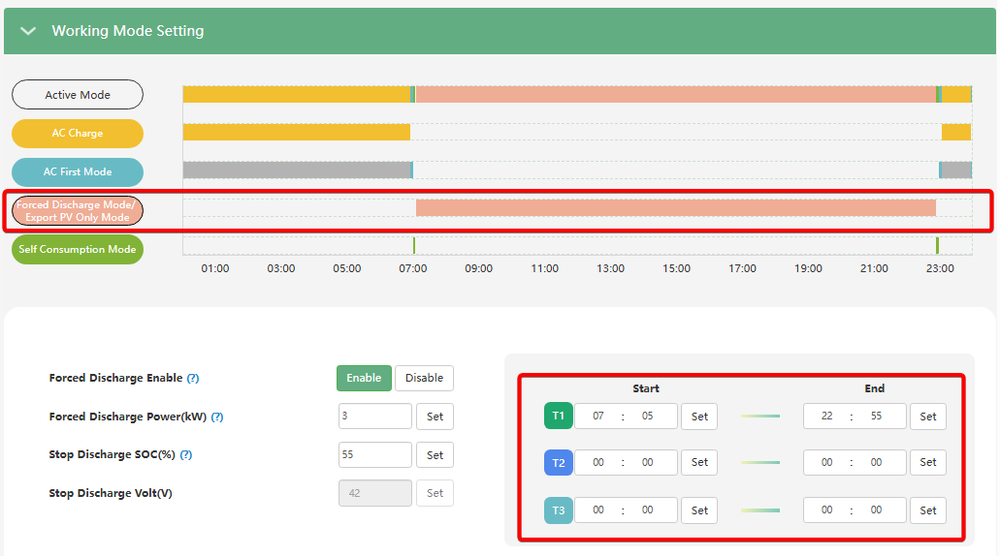

# Часові проміжки режиму Forced Discharge (Time 1, Time 2, Time 3)

## Призначення

Ці параметри дозволяють задати до трьох незалежних часових вікон (періодів) протягом доби, під час яких інвертору дозволено примусово розряджати акумуляторну батарею.

Саме ці таймери дають команду системі "почати продаж" енергії з батареї в мережу і "зупинити продаж", коли час вийде (або коли буде досягнуто кінцевого порогу `Stop Discharge SOC`). Це дозволяє максимально гнучко підлаштуватися під години пікового споживання чи найвищих тарифів.

## Доступ

| Installer Web | End-User Web | Mobile App | Display (LCD) |
| :-----------: | :----------: | :--------: | :-----------: |
|      ✅       |      ?       |     ?      |       ?       |

> [!Note] З'явилось у прошивці cBaa-338F99 від 2026-01-08.

## Діапазон значень

- **Мінімум:** 00:00.
- **Максимум:** 23:59.
- **Крок:** 1 хвилина.
- **За замовчуванням:** 00:00 – 00:00 (Часовий проміжок неактивний).

## Рекомендовані значення

- **Для експорту за піковими цінами (Net Billing / Зелений тариф):** Налаштуйте таймер на години вечірнього (або ранкового) максимуму, коли електроенергія найдорожча. Наприклад, **T1 Start: 18:00**, **T1 End: 22:00**.
- **Для звичайного користування (без експорту):** Усі таймери повинні залишатися в нулях `00:00 - 00:00`, щоб інвертор працював у базовому автономному режимі і віддавав енергію лише на потреби будинку.

## Примітки та важливі обмеження

> [!WARNING] Конфлікт пріоритетів таймерів:
> `Forced Discharge` має нижчий пріоритет, ніж `AC Charge` (Заряд від мережі) та `AC First` (Живлення будинку від мережі). Якщо ви випадково налаштуєте час примусового розряду на ті ж самі години, що й зарядку від мережі (наприклад, обидва з 00:00 до 06:00), **примусовий розряд не увімкнеться**. Перевіряйте, щоб ці таймери не перетиналися.

> [!TIP] Правило одного таймера:
> Якщо вам потрібен лише один період примусового розряду (наприклад, тільки вечірній), використовуйте лише `Start Time 1 / End Time 1`. Поля для T2 і T3 залиште без змін (`00:00 - 00:00`). Заповнювати всі три слоти однаковими значеннями не потрібно.

## Коли змінювати:

Налаштовуйте ці періоди тоді, коли ви активуєте загальну функцію примусового розряду (`Forced Discharge Enable`). Коригуйте години, якщо у вашому регіоні змінилися тарифи, або якщо взимку вечірній пік споживання настає раніше, ніж влітку, щоб оптимізувати ваш прибуток від експорту електроенергії.
