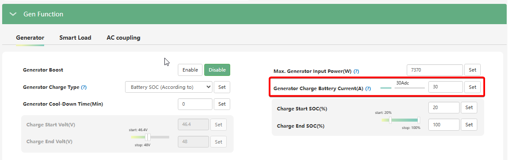

# Generator Charge Battery Current (A)

## Призначення

Цей параметр встановлює максимально допустимий струм (в Амперах), яким генератор може заряджати акумуляторну батарею.

Важливо розуміти, що налаштування заряджання від міської мережі (`AC Charge`) жодним чином не впливають на роботу генератора. Якщо ви хочете, щоб генератор заряджав батарею під час своєї роботи, ви повинні налаштувати струм саме в цьому меню.

## Доступ

| Installer Web | End-User Web | Mobile App | Display (LCD) |
| :-----------: | :----------: | :--------: | :-----------: |
|      ✅       |      ?       |     ?      |     ✅ 07     |

_(На РК-дисплеї інвертора цей параметр знаходиться під індексом **07**, разом із налаштуванням струму заряду від мережі)_.

## Діапазон значень

- **Мінімум:** 0 А.
- **Максимум:** 110 А (?).
- **Крок:** 1 А.
- **За замовчуванням:** Зазвичай встановлено на 30 А.

## Рекомендовані значення

Вибір значення залежить від потужності вашого генератора:

- **Для малопотужних генераторів (наприклад, 3 кВт) з одночасним живленням будинку:** `10 А - 20 А`. Це дозволить повільно заряджати батарею, залишаючи левову частку потужності генератора для живлення побутових приладів.
- **Для потужних генераторів (5 кВт+):** `40 А - 60 А` і вище. Чим вищий струм ви встановите, тим швидше генератор зарядить батарею і тим швидше ви зможете його заглушити, заощаджуючи пальне.

## Логіка роботи та важливі обмеження

> [!WARNING] Динамічне підпорядкування ліміту потужності генератора:
> Струм заряду батареї від генератора не є жорстко фіксованим. Якщо ви ввімкнули в будинку потужні прилади, і загальне споживання наблизилося до встановленого ліміту `Max. Generator Input Power`, інвертор **автоматично зменшить** струм заряду батареї аж до 0 А. Пріоритет завжди віддається живленню будинку.

> [!WARNING] Логіка паралельних систем (Дуже важливо!):
> Якщо у вас встановлено декілька інверторів у паралель, зміна цього параметра на будь-якому з інверторів автоматично синхронізується з іншими. **Але струми сумуються!** Обов'язково переконайтеся, що `Generator Charge Battery Current` помножений на кількість інверторів (N) є меншим або дорівнює загальному ліміту заряду батареї (`Charge Current Limit`). Наприклад, якщо у вас 3 інвертори, і ви встановите тут 30 А, загальний струм заряду від генератора становитиме 90 А.

> [!NOTE] Підпорядкування BMS та глобальному ліміту:
> Встановлений тут струм від генератора ніколи не перевищить значення глобального ліміту `Charge Current Limit` (меню 06) та не перевищить обмежень CCL, які диктує BMS літієвої батареї.

> [!NOTE] Залежність від гібридного режиму:
> Логіка роботи генератора залежить від налаштування `PV&AC Take Load Jointly`

## Коли змінювати:

Обов'язково налаштуйте цей параметр під час пусконалагоджувальних робіт з підключенням генератора.

- **Зменшуйте** його, якщо ваш генератор "захлинається" від навантаження або йде в захист при запуску (це означає, що інвертор намагається забрати занадто багато струму на зарядку розрядженої батареї).
- **Встановіть на 0 А**, якщо ви хочете, щоб генератор виключно живив будинок під час блекауту, але не витрачав пальне на заряджання батареї.
