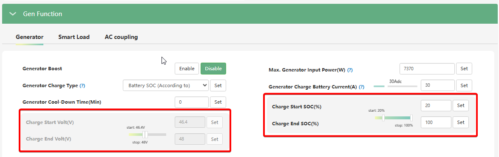

# Charge Start SOC(%) / Volt(V) та Charge End SOC(%) / Volt(V)

## Призначення

Ці параметри працюють у парі та визначають "вікно" (діапазон) для примусового заряджання акумуляторної батареї від генератора (Gen Charge) за відсутності зовнішньої мережі.

- **`Charge Start SOC(%)` / `Charge Start Volt(V)`:** Встановлює нижній поріг рівня заряду (у відсотках) або напруги (у Вольтах). Коли акумулятор розряджається до цього значення, інвертор активує заряджання від працюючого генератора.
- **`Charge End SOC(%)` / `Charge End Volt(V)`:** Встановлює верхній поріг. Коли батарея заряджається до встановленого тут значення, інвертор припиняє зарядку від генератора,.

## Доступ

| Installer Web | End-User Web | Mobile App |     Display (LCD)     |
| :-----------: | :----------: | :--------: | :-------------------: |
|      ✅       |      ?       |     ?      | ✅ 16 (AC) / 25 (Gen) |

_(На РК-дисплеї інвертора налаштування порогів для міської мережі знаходяться в меню **16**, а пороги для генератора — в меню **25**)._

## Діапазон значень

**Для порогу початку заряду від генератора (Charge Start):**

- **SOC (%):** від 1% до 90%.
- **Volt (V):** 38.4 В – 52.0 В.

**Для порогу закінчення заряду від генератора (Charge End):**

- **SOC (%):** від 20% до 100%,.
- **Volt (V):** 48.0 В – 59.0 В,.

## Рекомендовані значення

Вибір залежить від того, чи керується ваша система за відсотками (для літію з комунікацією) чи за напругою (для свинцю/гелю та літію без комунікації).

- **Для сучасних літієвих батарей (LiFePO4):**
  - `Charge Start SOC`: Зазвичай встановлюється на рівні 20% – 30% (або вище, якщо ви хочете тримати більший резерв).
  - `Charge End SOC`: 80% – 100%. Встановлення на 80-90% залишає резервний "об'єм" для безкоштовної сонячної генерації наступного дня.
- **Для свинцево-кислотних / гелевих АКБ:**
  - `Charge Start Volt`: Оптимально в діапазоні 47.0 В – 49.0 В.
  - `Charge End Volt`: Оптимально 49.0 В – 53.0 В.

## Логіка роботи та важливі особливості

> [!Warning] Залежність від PV+AC
> Логіка роботи залежить від налаштування [`PV&AC Take Load Jointly`](pv_ac_take_load_jointly)

> [!NOTE] Роздільні налаштування для Мережі та Генератора:
> Зверніть увагу, що інвертор має абсолютно окремі блоки налаштувань для заряджання від мережі (`AC Charge`) та від генератора (`Gen Charge`). Налаштування параметрів `AC Charge Start / End` жодним чином не вплинуть на генератор. Якщо ви бажаєте, щоб працюючий генератор заряджав батарею, обов'язково налаштуйте саме групу параметрів `Gen Charge Start / End`.

> [!TIP] Взаємодія з автозапуском генератора (Dry Contact):
> Реле сухого контакту інвертора подає сигнал на автозапуск генератора, спираючись на параметр попередження (`Battery Warning SOC / Volt`). Проте генератор почне **заряджати батарею** лише тоді, коли її рівень впаде до встановленого вами `Charge Start SOC / Volt`. Тому ці параметри мають бути узгоджені (наприклад, Warning = 25%, Charge Start = 25% або трохи нижче). Відповідно, інвертор зніме сигнал на роботу генератора (зупинить його), коли заряд досягне порогу `Charge End`.

## Коли змінювати:

Гнучке налаштування цих порогів є вашим головним інструментом економії.

- **Взимку:** Рекомендуємо підняти `Charge Start SOC` (наприклад, до 50-60%), щоб генератор включався раніше та підтримував високий рівень автономності перед імовірними відключеннями.
- **Влітку (з великим масивом сонячних панелей):** Опустіть `Charge Start SOC` до 15-20%, а `Charge End SOC` встановіть на рівні 50-60%. Це змусить інвертор брати мінімум енергії від генератора, залишаючи акумулятор напівпорожнім для того, щоб зранку він повністю зарядився від безкоштовної енергії сонця.
