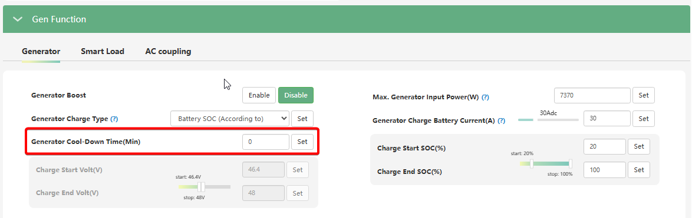

# Generator Cool-Down Time (Min) / Захисна пауза після вимкнення

## Призначення

Цей параметр працює як **таймер блокування повторного запуску (lockout timer)** з боку інвертора.

Він визначає час (у хвилинах), протягом якого інвертору **заборонено** знову замикати реле сухого контакту (подавати команду на старт) після того, як він щойно дав команду на вимкнення генератора.

**Важливе уточнення:** Це _не час роботи генератора на холостих обертах_ перед повною зупинкою. За охолодження двигуна на холостому ходу має відповідати виключно власна автоматика (контролер АВР/ATS) вашого генератора. Функція інвертора полягає лише в тому, щоб витримати задану "паузу тиші", коли сухий контакт розімкнуто.

## Доступ

| Installer Web | End-User Web | Mobile App | Display (LCD) |
| :-----------: | :----------: | :--------: | :-----------: |
|      ✅       |      ?       |     ?      |      🚫       |

## Діапазон значень

- **Мінімум:** 0.1 хв (6 секунд).
- **Максимум:** 25.5 хв.
- **Крок:** 0.1 хв.

## Рекомендовані значення

- **Оптимально:** `3.0 – 5.0 хв`. Цього часу достатньо, щоб генератор встиг відпрацювати свій цикл зупинки на холостих, повністю зупинитися і трохи охолонути перед тим, як система зможе знову його "смикнути".

## Логіка роботи (Як це працює на практиці)

1. **Зупинка:** Батарея заряджається до заданого порогу `Charge End SOC`, і інвертор розмикає сухий контакт (знімає команду на роботу).
2. **Власна робота АВР:** Контролер генератора бачить відсутність сигналу, переводить генератор на холості оберти (наприклад, на 1 хвилину для охолодження альтернатора) і потім глушить двигун.
3. **Блокування від інвертора:** Водночас із розмиканням контакту в інверторі стартує таймер `Generator Cool-Down Time`.
4. **Захист:** Якщо через 30 секунд після зупинки в будинку раптово вмикають потужний прилад (бойлер/насос) і напруга батареї різко падає до порогу `Charge Start`, інвертор **проігнорує** цю просадку. Він дочекається повного завершення нашого таймера (наприклад, 5 хвилин), і лише тоді знову замкне контакт для запуску генератора.

## Коли змінювати:

Збільшуйте цей параметр, якщо ваша система схильна до "тактування" — занадто частих стартів та зупинок генератора (наприклад, через невелику ємність батареї або різкі стрибки споживання в будинку). Ця пауза захистить стартер та поршневу групу генератора від зносу через безперервні спроби запуску одразу після глушіння.
