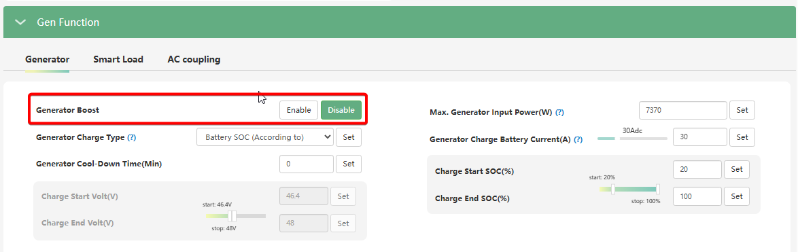

# Generator Boost (Підтримка генератора / GEN BOOST)

## Призначення

Ця функція дозволяє системі використовувати енергію від сонячних панелей (PV) та акумуляторної батареї для **допомоги генератору** у живленні навантаження, якщо потужності самого генератора стає недостатньо.

## Доступ

| Installer Web | End-User Web | Mobile App | Display (LCD) |
| :-----------: | :----------: | :--------: | :-----------: |
|      ✅       |      ?       |     ?      |     ✅ 30     |

_(На РК-дисплеї інвертора ця функція налаштовується під індексом **30**)._

## Діапазон значень

- **`Disable` (Вимкнено):** Значення за замовчуванням. Коли генератор працює, він бере на себе все навантаження будинку та заряджає батарею. В такій конфігурації бажано щоб генератор мав достатню потужність щоб забезпечити заряд батареї та живлення споживачів. LuxPower рекомендує, щоб номінальна потужність генератора принаймні в 1,5 раза перевищувала вихідну потужність інвертора для забезпечення як живлення навантаження, так і потреб заряджання акумулятора. В інакшому випадку генератор може заглохнути через надмірне навантаження.
- **`Enable` (Увімкнено):** Функція допомоги генератору активна. Тепер якщо навантаження в якийсь момент перевищить потужність генератора, нестача покриється з батареї та/або сонячних панелей.

## Рекомендовані значення

- **`Enable` (Увімкнено)**, якщо у вас встановлено генератор, потужність якого менша за ваші пікові потреби (наприклад, генератор на 2-3 кВт, а навантаження будинку періодично сягає 5 кВт). Включення цієї функції не дасть генератору "заглохнути" від перевантаження.

## Логіка роботи та важливі обмеження

> [!WARNING] Апаратні обмеження (Підтримка моделями):
> Функція `Generator Boost` вимагає наявності внутрішнього трансформатора струму (CT) на порту GEN. Це можливо на інверторах серії SNA6000, та нових версіях SNA5000 (де в серійному номері є літера `V`). Старі версії інверторів (без вбудованого CT на порту генератора) цю функцію не підтримують: на них сонячна енергія не зможе підтримувати генератор у живленні навантаження для безпеки самого генератора.

> [!NOTE] Захист генератора та плавна робота:
> Коли функція активована, система резервує певний запас потужності для генератора, щоб уникнути його частих коливань та перевантажень. Це продовжує термін служби генератора та підвищує надійність роботи всієї системи.

> [!WARNING] Known bugs
> Деякі користувачі повідомляють що в них `Generator Boost` не працює, через що малопотужні генератори (як інверторні так і звичайні) ідуть в захист, і система переходить на батарею. Причини поки невідомі.

## Коли змінювати:

Вмикайте (`Enable`) цю функцію, якщо під час тривалих блекаутів ви користуєтеся малопотужним генератором і помічаєте, що він не справляється при вмиканні потужних побутових приладів (наприклад, насоса чи бойлера). Завдяки цій функції, якщо є достатньо сонця або заряду в акумуляторі, інвертор "дотягне" нестачу потужності самостійно, забезпечивши стабільну напругу в будинку та захистивши генератор від зупинки.
