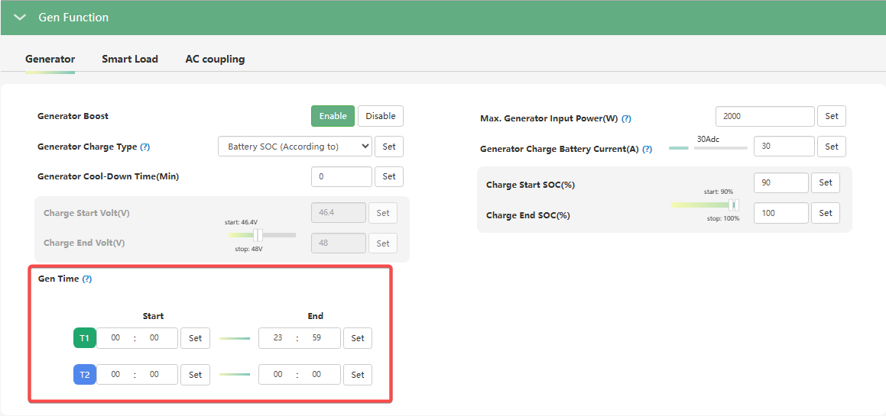

# Gen Time

###### (Час роботи генератора)

## Призначення

Дозволяє задати часові проміжки (для двох вікон: T1 та T2), протягом яких інвертору дозволено автоматично запускати генератор через "сухі контакти" (Dry contacts).

## Логіка роботи

Функція підпорядковує автоматичний запуск генератора заданому розкладу:

1. **В межах заданого часу (Within Gen Time):**
   Якщо поточний час підпадає під один із встановлених проміжків (T1 або T2), інвертор відстежує стан батареї. Як тільки напруга або рівень заряду батареї (SOC) падає до встановленого порогу `Charge Start Volt/SOC`, інвертор подає сигнал через сухі контакти на автоматичний запуск генератора.
2. **Поза межами заданого часу (Outside Gen Time):**
   Якщо поточний час виходить за межі налаштованих вікон, інвертор **ігнорує** автозапуск. Генератор **не запуститься**, навіть якщо батарея розрядиться і досягне порогу `Charge Start Volt/SOC`. Якщо генератор працював, але заданий час сплив, інвертор дасть команду на його зупинку.

## Як налаштувати

Ви можете встановити до двох незалежних часових проміжків (T1 та T2). Для кожного проміжку задається час початку та час завершення.

- **Для цілодобової роботи (Без обмежень):** Якщо ви хочете, щоб генератор міг запуститися автоматично в будь-який час доби, як тільки розрядиться батарея, встановіть для одного з таймерів значення з `00:00` до `23:59`.

## Примітки

> [!TIP] Практичне застосування (Режим тиші вночі)
> Це налаштування використовують, щоб генератор не заважав спати клієнтам або їхнім сусідам. Наприклад, ви можете налаштувати `Gen Time` з `08:00` до `21:00`. У такому разі, навіть якщо вночі зникне мережа і батарея розрядиться до критичного рівня, генератор не запуститься. Система дочекається 08:00 ранку, і лише тоді відбудеться автоматичний старт.

> [!NOTE] Залежні параметри
> Щоб функція спрацювала, крім самого часу, мають бути налаштовані ліміти старту та зупинки (`Charge Start Volt/SOC` та `Charge End Volt/SOC`).
