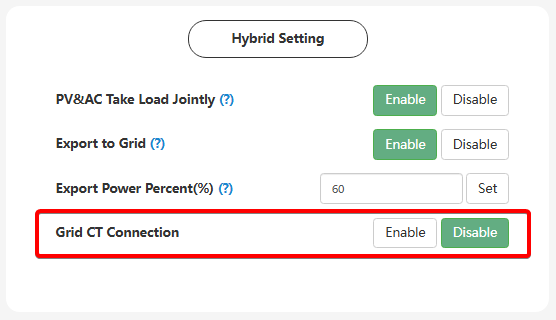
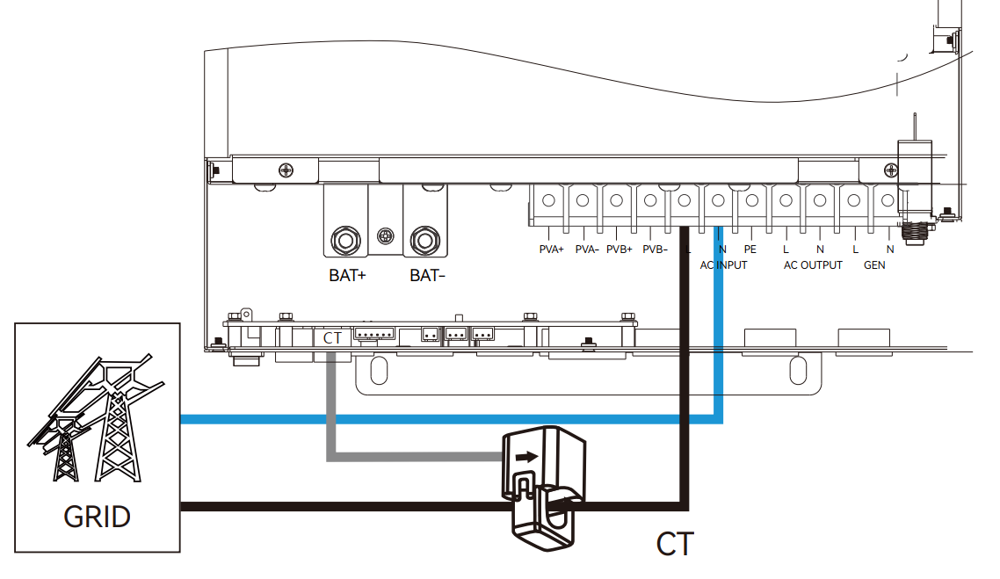

# Grid CT Connection

###### (Підключення трансформатора струму мережі)

## Призначення

Ця функція активує роботу зовнішнього трансформатора струму (CT), який встановлюється на головному вводі в будинок (після лічильника). Її головне завдання — дозволити інвертору "бачити" загальне споживання всього будинку, включаючи ті прилади, які підключені перед інвертором (на лінії Grid, а не на лінії резерву EPS). Завдяки цьому інвертор може скеровувати надлишкову сонячну енергію або енергію з батареї на компенсацію цього "зовнішнього" споживання, а також контролювати або обмежувати експорт у загальну мережу.

## Доступ

| Installer Web | End-User Web | Mobile App | Display (LCD) |
| :-----------: | :----------: | :--------: | :-----------: |
|      ✅       |      ?       |     ?      |     ✅ 24     |

_(В електронних кабінетах налаштування знаходиться у розділі Application Setting -> Hybrid Setting. На РК-дисплеї інвертора воно доступне в меню **24** під назвою **External Grid CT**)._

## Стани (Значення)

- **Disable (Вимкнено, за замовчуванням):** Інвертор не зчитує дані з порту CT. У цьому стані він аналізує та компенсує сонячною енергією/батареєю **лише** те навантаження, яке підключене безпосередньо до його резервного виходу (EPS Output). Будь-яке інше споживання в будинку ігнорується інвертором.
- **Enable (Увімкнено):** Інвертор активує опитування зовнішнього трансформатора струму. Це обов'язкова умова, якщо ви хочете, щоб інвертор компенсував споживання приладів підключений перед інвертором.

## Примітки та особливості

> [!WARNING] Апаратна сумісність (Старі vs Нові моделі):
> Зверніть увагу, що ця функція працює **лише** на моделях SNA6000 та на оновленій лінійці SNA5000 (у яких в серійному номері присутня літера "V", наприклад, 512**V**XXXXXXX). Старі версії SNA5000 фізично не мають порту для підключення CT-трансформатора, тому для них увімкнення цього параметра не дасть жодного ефекту.

> [!NOTE] Правило напрямку (важливо):
> Фізичний монтаж трансформатора струму вимагає дотримання напрямку. Стрілка на самому трансформаторі (CT) повинна вказувати напрямок **від міської мережі до інвертора**. Якщо стрілка вказуватиме у зворотному напрямку, інвертор отримуватиме дзеркальні (хибні) дані, що призведе до некоректної роботи системи.
> 

> [!TIP] Програмний реверс CT:
> Якщо під час монтажу у щитку ви випадково встановили CT задом наперед, вам не обов'язково їхати на об'єкт для фізичного перепідключення. Зайдіть у розділ `Advanced Setting` (або `CT/Meter Settings`) і змініть параметр `CT Direction Reversed` (або `CT Direction`) з Normal на Reversed. Це програмно розверне напрямок зчитування.

## Коли змінювати:

Переводьте у стан `Enable` під час пусконалагодження системи, якщо ви фізично встановили CT-трансформатор на вводі в будинок і плануєте використовувати функції компенсації власного споживання (Self-consumption) для нерезервних ліній або обмежувати продаж енергії в мережу.
