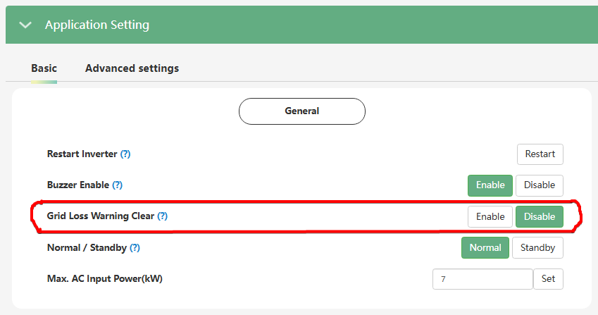

# Grid Loss Warning Clear

Налаштування **`Grid Loss Warning Clear`** (Очищення попередження про втрату мережі), керує відображенням сповіщень про зникнення напруги в зовнішній електромережі.

|        | installer web | end-user web | mobile app | Display |
| :----: | :-----------: | :----------: | :--------: | :-----: |
| доступ |      ✅       |      🚫      |     🚫     |   🚫    |

### Доступні стани:

- **`Enable (Увімкнено):`** Система перестає відправляти попередження, пов'язані з втратою мережі змінного струму (Warning 16 "No AC Connection"). Увімкнувши цей параметр, ви припините отримувати попередження про відсутність мережі.
- **`Disable (Вимкнено):`** Це стандартний робочий стан. Інвертор буде працювати у звичайному режимі і завжди сповіщатиме вас (візуально та записами в історії) про кожне зникнення електроенергії на вході.

> Якщо ви хочете "заглушити" попередження системи про те, що мережа зникла, встановіть стан `Enable`. Якщо ж вам важливо бачити кожну подію втрати мережі, залиште стан `Disable`.
