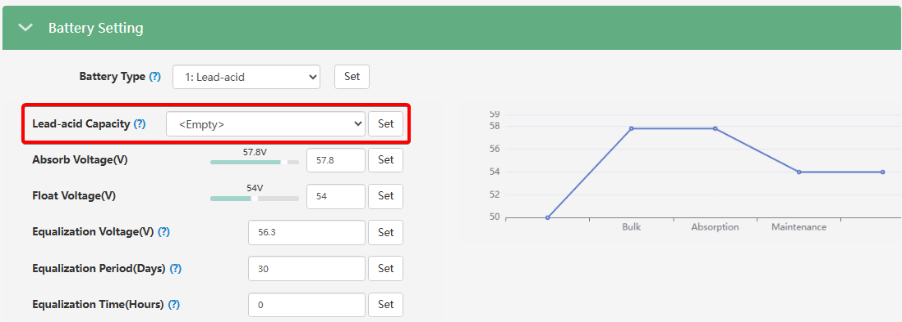

# Lead-acid Capacity

###### (Ємність свинцево-кислотної батареї)

## Призначення

Цей параметр використовується для того, щоб повідомити інвертору сумарну ємність підключеного масиву свинцево-кислотних акумуляторів (AGM, GEL, Flooded) або інших акумуляторів без комунікації, які налаштовані в системі як "Lead-acid". Завдання цього параметра — вказати системі правильний розмір підключеного накопичувача енергії для коректного розрахунку рівня заряду.

## Доступ

| Installer Web | End-User Web | Mobile App | Display (LCD) |
| :-----------: | :----------: | :--------: | :-----------: |
|      ✅       |      ?       |     ?      |     ✅ 03     |

_(На РК-дисплеї інвертора налаштування ємності є другим кроком у меню **03** безпосередньо після вибору типу батареї "Lead-Acid")._

## Діапазон значень

- **Діапазон:** від 50 А·год до 5000 А·год (Ah).

## Рекомендовані значення

Встановлюйте значення, яке точно відповідає сумарній ємності вашого 48-вольтового акумуляторного масиву:

- **Тільки послідовне з'єднання:** Якщо ви з'єднали чотири 12-вольтові акумулятори по 100 А·год послідовно (щоб отримати робочі 48 В), загальна ємність системи залишається **100 А·год**. Саме це значення необхідно ввести в налаштуваннях.
- **Паралельно-послідовне з'єднання:** Якщо у вас дві такі 48-вольтові збірки (по 100 А·год кожна), з'єднані між собою паралельно, загальна ємність сумується і становитиме **200 А·год**.

## Логіка роботи та важливі обмеження

> [!NOTE] Особливості розрахунку заряду (SOC):
> При роботі зі свинцево-кислотними акумуляторами інвертор не має прямого зв'язку з BMS батареї для точного отримання відсотків заряду (SOC). Рівень заряду вираховується алгоритмами інвертора орієнтовно, спираючись на поточну напругу на клемах. Тому параметр ємності (Capacity) є допоміжним, а головним орієнтиром для безпечної роботи завжди залишаються налаштування напруги: [`Absorb Voltage`](/settings/absorb_voltage), [`Float Voltage`](/settings/float_voltage).

> [!WARNING] Ручне обмеження струму заряду:
> Зверніть увагу, що введення ємності не змушує інвертор автоматично вираховувати та обмежувати безпечний струм заряду. Ви як інсталятор повинні вручну налаштувати параметр [`Charge Current Limit`](/settings/charge_current_limit_adc) відповідно до рекомендацій виробника батареї. Класичне правило для свинцево-кислотних АКБ — струм заряду має становити 0.1C – 0.2C (від 10% до 20% від ємності). Тобто, для банку на 100 А·год максимальний струм заряду слід обмежити на рівні 10–20 Ампер.

## Коли змінювати:

Цей параметр необхідно налаштувати під час початкового пусконалагодження системи під час конфігурації меню типу батареї "Lead-acid". Також значення слід обов'язково оновити, якщо клієнт згодом вирішить розширити свій масив АКБ, додавши нові гілки акумуляторів паралельно.
