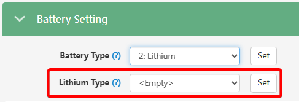

# Lithium Type

##### вибір протоколу комунікації

## Призначення

Цей параметр стає доступним і обов'язковим для налаштування, якщо в базовому меню [`Battery Type`](/settings/battery_type) ви обрали `Lithium`. Він визначає **протокол комунікації (CAN або RS485)**, яким інвертор буде обмінюватися даними з платою керування (BMS) вашого акумулятора. Правильний вибір `Lithium Type` забезпечить коректне зчитування даних від BMS, зокрема рівень заряду (SOC%), температуру, напругу комірок, динамічні ліміти струмів заряду та розряду (CCL/DCL), та інші параметри.

## Доступ

| Installer Web | End-User Web | Mobile App | Display (LCD) |
| :-----------: | :----------: | :--------: | :-----------: |
|      ✅       |      ?       |     ?      |     ✅ 03     |

_(На РК-дисплеї інвертора цей вибір здійснюється відразу після підтвердження типу `Li-ion` у меню під індексом **03**)._

## Діапазон значень та офіційна сумісність

Хоча у вебмоніторингу відображається широкий список (як у наведеному вами селекторі), згідно з офіційною документацією та практикою LuxPower, найчастіше використовуються такі протоколи для популярних 48-вольтових акумуляторів:

- **`0: Standard Battery`**: Базовий протокол.
- **`1: HINA Battery`**: Для оригінальних батарей партнерського бренду HinaESS (моделі Hi-5, PowerGem, PowerWave).
- **`2: Pylon/Freedom Won/Solar MD/Hubble/Blue Nova`**: Найпопулярніший протокол на базі PylonTech.
- **`6: Lux`**: протокол LuxpowerTek. Також використовується для Pytes, Dowell, HANCHU, LBSA (Smart units) та Felicitysolar (з прошивкою BMS від V409).
- **`8: Rsvd`** батареї Dyness (раніше були в списку сумісних, але тепер ні).

## Примітки та важливі деталі

> [!WARNING] **Помилка зв'язку Warning 00 (Battery Com Fault):**
> Якщо ви оберете неправильний код бренду, комунікація між BMS та інвертором може бути нестабільною або відсутньою. У цьому випадку на дисплеї та в додатку з'явиться помилка `Warning 00`. Для захисту системи інвертор автоматично заблокує і заряджання, і розряджання акумулятора, доки зв'язок не буде відновлено.

> [!NOTE] **Правильний кабель (Pinout):**
> Вибір протоколу — це лише частина налаштування. Для успішної роботи потрібен сумісний комунікаційний кабель. Інвертори LuxPower (серії SNA) використовують для CAN-зв'язку контакти **PIN 4 (CAN H)** та **PIN 5 (CAN L)**. Розпіновка з боку батареї може відрізнятися. Наприклад, для батарей PylonTech контакти 1-3 з їхнього боку мають бути відрізані/відключені, щоб уникнути конфліктів.

> [!TIP] **Автоматичне перезавантаження:**
> Після вибору бренду літієвої батареї в меню та натискання кнопки підтвердження, інвертор автоматично вимкнеться і ввімкнеться знову (перезавантажиться). Це абсолютно нормальна поведінка — системі потрібно застосувати нові протоколи зв'язку.

## Коли змінювати:

Це налаштування виконується **одноразово** під час пусконалагодження системи (коли ви вперше підключаєте літієву батарею). Змінювати його в майбутньому потрібно лише в тому випадку, якщо ви замінюєте акумулятор на інший бренд із відмінним протоколом. Якщо ж ви використовуєте "самозбірку" без кабелю комунікації, цей параметр вам не потрібен (в основному меню [`Battery Type`](/settings/battery_type) треба обрати `Lead-acid`).
