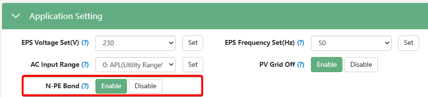

# N-PE Bond (Об'єднання нуля та заземлення)

> [!Note] Станом на 04-2026 доступне лише через стару сторінку налаштувань.

## Призначення

Ця функція керує вбудованим реле інвертора, яке автоматично з'єднує нульовий провідник (Neutral, N) на виході резервного живлення (EPS) із захисним контуром заземлення (PE) у той час, коли інвертор працює в автономному режимі (від батарей або сонця).

Це необхідно з двох причин:

1. **Захист від ураження струмом:** В автономному режимі інвертор видає "чисту" синусоїду, яка не має прив'язки до землі. Без об'єднання N-PE на обох контактах розетки (фаза і нуль) з'являється "плаваюча" напруга (близько 115 В відносно землі). Об'єднання фіксує нуль, залишаючи небезпечну напругу (230 В) лише на фазному провіднику.
2. **Робота захисної автоматики:** Щоб ваші пристрої захисного відключення (ПЗВ / дифавтомати / RCD) могли коректно виявити витік струму на корпус приладу і врятувати життя людині, системі потрібен чіткий шлях для струму короткого замикання. N-PE Bond створює цей шлях із низьким опором.

## Доступ

| Installer Web | End-User Web | Mobile App | Display (LCD) |
| :-----------: | :----------: | :--------: | :-----------: |
|      ✅       |      ?       |     ?      |     ✅ 26     |

_(Через вебінтерфейс параметр знаходиться на старій сторінці налаштувань. На РК-дисплеї інвертора — під індексом **26**)_.

## Діапазон значень

- **`Enable` (Увімкнено):** Вбудоване реле N-PE активне.
- **`Disable` (Вимкнено):** Значення за замовчуванням.Вбудоване реле N-PE деактивоване.

## Логіка роботи

- **Коли є міська мережа (Grid On):** Вбудоване реле N-PE розімкнуте (не працює). Інвертор просто пропускає електроенергію з мережі "як є". Безпеку забезпечує об'єднання нуля та землі на стороні трансформаторної підстанції або у вашому головному вхідному щиті (відповідно до системи заземлення TN-C-S).
- **Коли мережа зникає (Grid Off / Блекаут):** Вхідне реле інвертора фізично відрізає будинок від міської мережі (включаючи нуль). Одночасно з цим інвертор замикає внутрішнє реле N-PE, створюючи власну нейтраль на виході EPS для роботи домашньої автоматики. Як тільки міська мережа повертається, реле N-PE розмикається перед тим, як підключитися до мережі.

## Примітки та важливі особливості

> [!WARNING] Апаратні обмеження (Підтримка моделями):
> Вбудоване реле N-PE присутнє у всіх інверторах серії SNA, лише у SNA6000 та оновлених SNA5000 (де у серійному номері є літера `V`). Старі версії SNA5000 (без літери V) не мають цього реле всередині. Навіть якщо цей параметр відображається у вебінтерфейсі старого інвертора, фізично нічого не відбудеться, і для них об'єднання (за потреби) потрібно реалізовувати зовнішнім контактором (реле).

> [!NOTE] Умова для зміни стану:
> Згідно з інструкцією виробника, якщо ви хочете змінити цей параметр безпосередньо через кнопки на РК-дисплеї інвертора (меню 26), інвертор має бути переведений у режим очікування (Standby). Для цього необхідно або спочатку вимкнути апаратний перемикач `EPS Output` на нижній панелі інвертора, або перевести перемикач `Normal / Standby` у стан `Standby` через веб інтерфейс управління інвертором.

## Коли змінювати:

- **Встановлюйте `Enable`**, якщо присутнє окреме заземлення. Таким чином ваші дифавтомати не "осліпнуть" під час блекауту і зможуть захистити вас від ураження струмом.
- **Встановлюйте `Disable`**, якщо:
  1. Ваша локальна схема заземлення (наприклад, мережа типу IT) забороняє об'єднання нуля та землі.
  2. Ви або ваш інсталятор вже забезпечили умови для створення N-PE зв'язку у розподільчому щиті будинку, і повторне об'єднання не потрібне.
