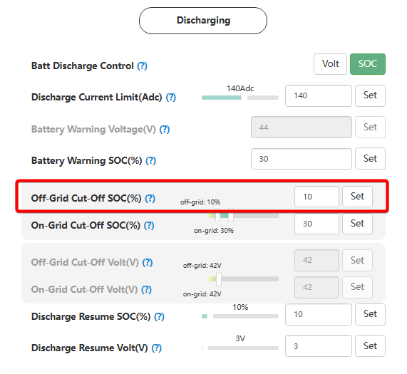

# Off-Grid Cut-Off SOC (%)

## Призначення

Цей параметр визначає критичний (найнижчий) поріг рівня заряду акумулятора (у відсотках), при досягненні якого інвертор **повністю зупиняє розряд** під час роботи в автономному режимі (коли зовнішня електромережа відсутня).

Головна мета цього налаштування — захистити вашу літієву батарею від глибокого, руйнівного розряду під час блекаутів. Коли заряд падає до цього значення, інвертор вимикає живлення будинку (навантаження на порту резервного живлення EPS знеструмлюється), щоб зберегти залишок енергії для підтримки роботи плати BMS батареї та очікування появи сонця чи запуску генератора.

## Доступ

| Installer Web | End-User Web | Mobile App | Display (LCD) |
| :-----------: | :----------: | :--------: | :-----------: |
|      ✅       |      ?       |     ?      |     ✅ 11     |

_(На РК-дисплеї інвертора це налаштування знаходиться під індексом **11** і має назву `CutOFF`)._

## Діапазон значень

- **Мінімум:** 0% (проте вкрай не рекомендується опускати нижче 10-15%).
- **Максимум:** Значення, встановлене в параметрі [`On-Grid Cut-Off SOC(%)`](/settings/on_grid_cut_off_soc).
- **Крок:** 1%.

## Рекомендовані значення

- **Від виробника:** Рекомендується встановлювати значення **вище 20%, але в жодному разі не нижче 15%**. Це залишає безпечний буфер ємності, який не дозволить батареї "заснути" або піти в глибокий захист до того моменту, як з'явиться сонце для її підзарядки.

## Логіка роботи та відновлення розряду (Restore discharge)

Згідно з алгоритмами LuxPower, процес вимкнення та подальшого відновлення живлення будинку має вбудований захист (гістерезис), щоб уникнути циклічного "клацання" інвертора при мінімальних коливаннях заряду:

1. **Зупинка:** Коли SOC падає до встановленого `Off-Grid Cut-Off SOC`, інвертор вимикає живлення будинку.
2. **Примусовий заряд:** Якщо з'являється джерело енергії (сонце або генератор), інвертор активує режим примусового заряду (Forced charge) щонайменше на **+3%** від встановленого порогу відключення.
3. **Відновлення живлення:** Інвертор не увімкне живлення будинку назад одразу. Розряд (подача напруги на будинок) буде дозволено лише після того, як батарея зарядиться до рівня: `Off-Grid Cut-Off SOC` + [`Discharge Resume SOC (%)`](/settings/discharge_resume_soc) _(окремий параметр гістерезису відновлення розряду)_.

## Примітки та важливі обмеження

> [!WARNING] **Жорсткий взаємозв'язок з On-Grid Cut-Off:**
> Значення `Off-Grid Cut-Off SOC` закладено в логіку так, що воно **обов'язково повинно бути меншим або дорівнювати** параметру [`On-grid Cut-Off SOC`](/settings/on_grid_cut_off_soc) (поріг розряду за наявності мережі). Інвертор просто не дозволить вам встановити автономний поріг вищим за мережевий. Логіка проста: в автономному режимі (під час блекауту) ви повинні мати доступ до глибшого резерву батареї, ніж за наявності стабільної міської мережі.

## Коли змінювати:

Встановлюйте цей параметр під час першого запуску системи. Збільшуйте його (наприклад, до 20-25%), якщо ви надовго залишаєте будинок без нагляду (щоб гарантувати більший запас енергії на компенсацію саморозряду до появи сонця) або якщо хочете максимально подовжити життєвий цикл ваших літієвих комірок, уникаючи їх надмірного розряду.
