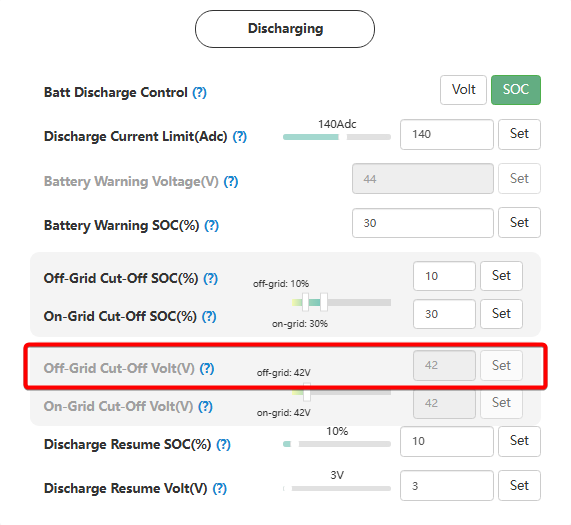

# Off-Grid Cut-Off Volt (V)

## Призначення

Цей параметр визначає критичний (найнижчий) поріг напруги акумуляторної батареї (у Вольтах), при падінні до якого інвертор **повністю зупиняє розряд** під час роботи в автономному режимі (коли зовнішня електромережа відсутня).

Головна мета цього налаштування — захистит від надмірного розряду. Коли напруга падає до цього значення, інвертор знеструмлює порт резервного живлення (EPS), щоб зберегти залишок енергії для очікування появи сонця чи запуску генератора.

## Доступ

| Installer Web | End-User Web | Mobile App | Display (LCD) |
| :-----------: | :----------: | :--------: | :-----------: |
|      ✅       |      ?       |     ?      |     ✅ 11     |

_(На РК-дисплеї інвертора це налаштування знаходиться під індексом **11** і має назву `CutOFF`)_.

## Діапазон значень

- **Мінімум:** 40.0 В.
- **Максимум:** Значення, встановлене в параметрі [`On-grid Cut-Off Volt(V)`](/settings/on_grid_cut_off_volt).
- **Крок:** 0.1 В.
- **За замовчуванням:** 42.0 В.

## Рекомендовані значення

- згідно рекомендацій виробника батареї.

## Логіка роботи та відновлення розряду (Restore discharge)

Згідно з алгоритмами LuxPower, процес вимкнення та подальшого відновлення живлення будинку має вбудований захист (гістерезис):

1. **Зупинка:** Коли напруга падає до встановленого `Off-Grid Cut-Off Volt`, інвертор вимикає живлення будинку.
2. **Відновлення живлення:** Інвертор не увімкне живлення будинку назад одразу при мінімальному підвищення напруги. Розряд (подача напруги на будинок) буде дозволено лише після того, як батарея зарядиться до рівня: `Off-Grid Cut-Off Volt` + гістерезис відновлення розряду [`Discharge Resume Volt(V)`](/settings/discharge_resume_volt).

## Примітки та важливі обмеження

> [!NOTE] Залежність від типу керування:
> Це налаштування є активним лише тоді, коли керування розрядом відбувається за напругою (параметр [`Batt Discharge Control`](/settings/batt_discharge_control) встановлено на `Voltage`). Якщо у вас літієва батарея з активною комунікацією BMS та керуванням за `SOC`, інвертор буде спиратися на відсотки, ігноруючи цей параметр у Вольтах.

> [!WARNING] Взаємозв'язок з [`On-grid Cut-Off Volt`](/settings/on_grid_cut_off_volt):
> Значення `Off-Grid Cut-Off Volt` закладено в логіку так, що воно **повинно бути меншим або дорівнювати** параметру [`On-grid Cut-Off Volt`](/settings/on_grid_cut_off_volt) (поріг розряду за наявності мережі). Логіка проста: в автономному режимі (під час блекауту) ви повинні мати доступ до глибшого резерву батареї, ніж за наявності стабільної міської мережі.

## Коли змінювати:

Встановлюйте цей параметр під час першого запуску системи, якщо ви використовуєте свинцево-кислотні акумулятори або літієві "самозбірки" без кабелю зв'язку з інвертором. Збільшуйте напругу відключення, якщо хочете уникнути надмірного розряду.
