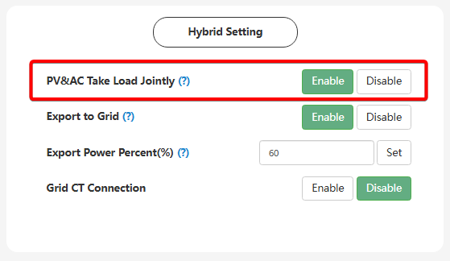

# PV&AC Take Load Jointly

## Призначення

Відповідає за дозвіл інвертору працювати в гібридному режимі підмішування. Коли функцію **увімкнено**, інвертор може одночасно живити домашнє навантаження енергією від сонячних панелей та плавно "добирати" необхідну нестачу із загальної електромережі (AC). Якщо ж функцію **вимкнено**, інвертор або повністю живитиме дім від мережі (через байпас), або повністю перейде на живлення від сонця/батареї, не змішуючи ці джерела.

## Доступ

| installer web | end-user web | mobile app | Display |
| :-----------: | :----------: | :--------: | :-----: |
|      ✅       |      ✅      |     ✅     |  ✅16   |

## Діапазон значень

- `Disable` (Вимкнено) - автономний режим без підмішування.
- `Enable` (Увімкнено) - гібридний режим спільного використання джерел.
- За замовчуванням: `Disable` (Вимкнено).

## Рекомендовані значення

- якщо є PV панелі: `Enable` (Увімкнено). Це найкращий вибір для максимізації економії, оскільки інвертор буде пріоритетно використовувати кожен доступний ват сонця, а з мережі братиме лише ту енергію, якої не вистачило.
- якщо PV панелі немає (**робота як ДБЖ**): `Disable` (Вимкнено).
- для літієвих акумуляторів із комунікацією BMS — `Enable` (Увімкнено): якщо BMS динамічно знижує дозволений струм розряду, функція замінює аварійне вимкнення виходу (Warning 28: EPS Overload) на плавну компенсацію дефіциту з мережі без переривання живлення навантаження.

## Логіка розподілу енергії (при Enable)

- **В межах часових вікон `AC First` та/або `AC Charge`**: Сонячна енергія пріоритетно заряджає батарею. Лише якщо є надлишок сонця, який батарея не може прийняти, він піде на живлення навантаження, а решту потреби покриє мережа. Для режиму `AC First` приорітет заряду батарї зберігається поки SOC не досягне `Stop Charge First SOC (%)`.
- **Поза вікнами AC First або AC Charge**: Сонячна енергія пріоритетно живить навантаження, а її надлишки заряджають батарею. Якщо сонця не вистачає, навантаження живитиметься спільно від сонця та батареї (без споживання з мережі).

## Робота з генератором (порт GEN):

- Якщо `Disable` (Вимкнено): генератор **не живить навантаження і не заряджає батарею**, поки не спрацюють умови зарядки від генератора (Charge Start SOC/Volt). Як тільки умови спрацюють, він одночасно живитиме дім і заряджатиме акумулятор.
- Якщо `Enable` (Увімкнено): генератор одразу почне живити навантаження після запуску, але заряджатиме батарею лише тоді, коли спрацюють умови зарядки

## Робота з Мікромережею (AC Coupling):

Якщо до порту GEN підключено мережевий інвертор, стан `PV&AC Take Load Jointly` змінює логіку роботи:

- При `Enable`: надлишки від мережевого інвертора будуть експортуватися в загальну мережу (обов'язково має бути увімкнено `Export to Grid`).
- При `Disable`: надлишки енергії будуть обмежуватися шляхом зміни частоти (Frequency Shifting). Для цього підключений мережевий інвертор повинен підтримувати функцію Frequency Response

## Взаємодія з динамічним лімітом розряду BMS (DCL)

Сучасні BMS літієвих акумуляторів із комунікацією можуть динамічно знижувати дозволений струм розряду (Discharge Current Limit, DCL) — через низьку температуру комірок, глибокий розряд, дисбаланс комірок або старіння збірки. Стан цієї функції визначає реакцію інвертора, коли навантаження потребує більше, ніж на даний момент дозволяє батарея:

- **`Enable`:** інвертор пропорційно знижує споживання з акумулятора, точно дотримуючись ліміту, повідомленого BMS, а дефіцит компенсує з мережі. Живлення навантаження не переривається, батарея не виходить за межі поточних можливостей.
- **`Disable`:** будь-яке перевищення дозволеного струму розряду (навіть на 1 А) призводить до переходу в байпас або до вимкнення виходу EPS з фіксацією попередження [Warning 28: EPS Overload](/troubleshooting/warnings#warning-28). При цьому вихід EPS фактично не перевантажений — інвертор просто позбавлений джерела, з якого міг би отримати потужність, заборонену BMS.

> [!NOTE] Роль PV-генерації:
> Перекладання частини навантаження з акумулятора на сонячні панелі в цій ситуації неможливе: PV-генерація вже надходить у навантаження з найвищим пріоритетом і задіяна повністю. Дефіцит, спричинений обмеженням BMS, покривається виключно з мережі.

## Коли змінювати

Вимикайте якщо інвертор працює без сонячних панелей, та не планується продаж в мережу з акумулятора.

## Примітки

> [!WARNING] Експорт у мережу (Export to Grid):
> Функція `PV&AC Take Load Jointly` є обов'язковою для увімкнення, якщо ви плануєте активувати продаж надлишків сонячної електроенергії в загальну мережу (експорт).

> [!TIP] Фантомне споживання з мережі (Реактивна потужність):
> При наявності зовнішньої мережі та включеному `PV&AC Take Load Jointly`, на вході (в додатку або на лічильнику) можна побачити струм, який на перший погляд вказує на завищене споживання. В такому випадку заміряйте саме активну потужність (Вт). Левова частина цього струму найчастіше є реактивною потужністю (ВАр), необхідною для синхронізації інвертора з мережею, яка побутовими лічильниками не обліковується і ви за неї не платите.

> [!WARNING] Мерехтіння освітлення на низькій потужності:
> У режимі підмішування за низької потужності навантаження можливе помітне мерехтіння освітлення (flicker). Це конструктивна особливість режиму, а не несправність. Якщо ваша BMS не підтримує динамічне обмеження струму розряду, цей недолік може переважити переваги функції — у такому разі її варто вимкнути. Якщо ж BMS керує лімітом розряду динамічно, захисний ефект (див. «Взаємодія з динамічним лімітом розряду BMS») зазвичай переважає цей недолік.
