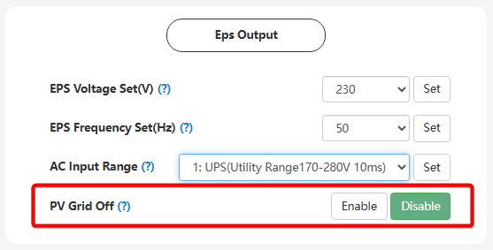

# PV Grid Off

## Призначення

Цей параметр відповідає за дозвіл інвертору використовувати енергію від сонячних панелей для живлення резервного навантаження (виходу EPS) в автономному режимі, навіть якщо акумуляторна батарея відсутня, вимкнена або повністю розряджена

## Доступ

| installer web | end-user web | mobile app | Display |
| :-----------: | :----------: | :--------: | :-----: |
|      ✅       |      🚫      |     🚫     |  ✅ 19  |

## Діапазон значень

- Вибір з двох станів: `Disable` (Вимкнено) або `Enable` (Увімкнено)

## Рекомендовані значення

- `Enable` (Увімкнено)
- За замовчуванням: `Enable` (Увімкнено)

## Примітки

- **Важливі обмеження:** Робота виключно від сонця без підтримки мережі або акумулятора є вкрай нестабільною. Оскільки вихідна потужність прямо залежить від рівня сонячної енергії в конкретну секунду, будь-яка хмарність або запуск потужного приладу призведе до миттєвого просідання напруги, і інвертор просто вимкне живлення будинку, щоб захистити систему.
- **Коли змінювати:** Залишайте цей параметр увімкненим. Це критично важлива функція для "холодного старту" після глибокого блекауту. Якщо вночі акумулятор розрядився в нуль і BMS його вимкнула, з появою ранкового сонця інвертор завдяки цій функції зможе самостійно запуститися від сонячних панелей, дати першу напругу в будинок і "розбудити" акумулятор для його заряджання. Без цієї функції при вимкненій батареї та відсутності мережі інвертор не подасть напругу на вихід.
