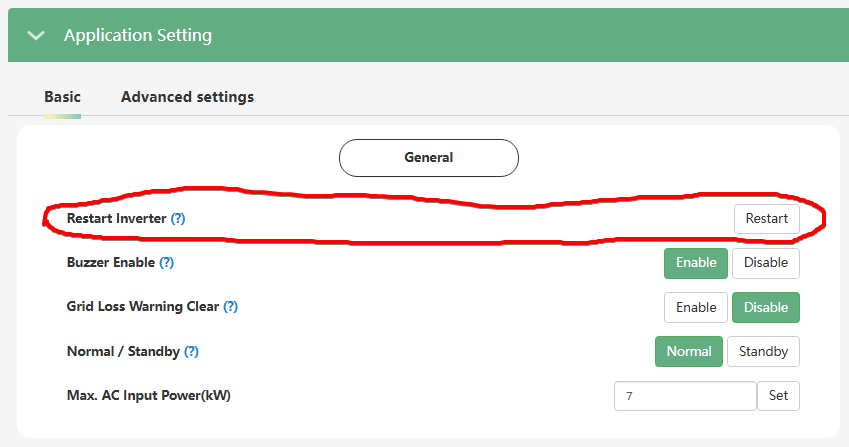

# Restart Inverter

Налаштування **`Restart Inverter`** з кнопкою **`Restart`** дозволяє виконати **віддалене апаратне перезавантаження** вашого інвертора безпосередньо через веб-портал або додаток.

|        | installer web | end-user web | mobile app | Display |
| :----: | :-----------: | :----------: | :--------: | :-----: |
| доступ |      ✅       |      🚫      |     🚫     |   🚫    |

### **Для чого це використовується:**

Якщо інвертор поводить себе незвично, або ви зіткнулися з програмним збоєм чи "зависанням", найперша дія для усунення проблеми — це спробувати його перезавантажити. Ця кнопка дуже зручна для інсталяторів або користувачів, оскільки дозволяє скинути тимчасові помилки та відновити нормальну роботу системи дистанційно, без необхідності фізично підходити до пристрою.

> [!Warning] Оскільки натискання кнопки `Restart` призводить до фізичного вимкнення та повторного ввімкнення інвертора, це супроводжуватиметься тимчасовим зникненням напруги на лінії резервного живлення (на ваших споживачах). Тому, якщо ви збираєтеся перезавантажити систему, будьте обережні: переконайтеся, що в будинку не працює чутлива до відключень техніка, або обов'язково заздалегідь попередьте людей у приміщенні про короткочасне відключення світла.
