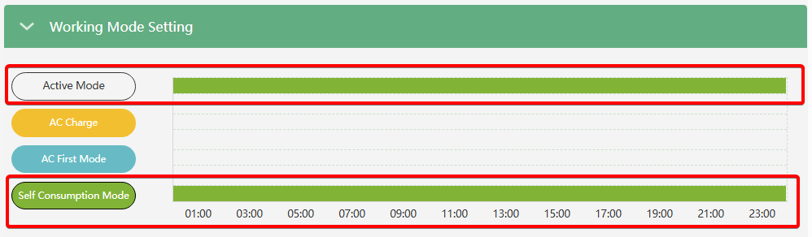
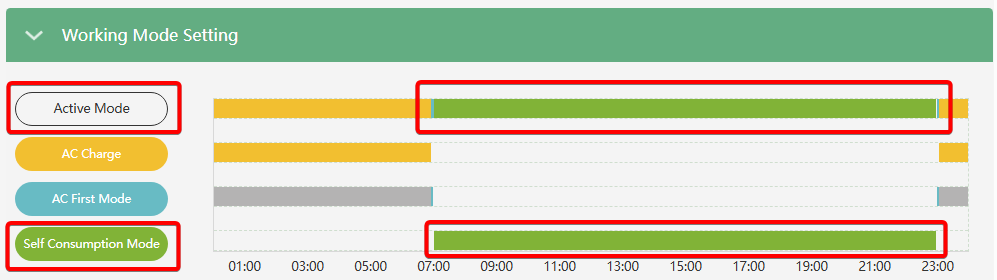

# Self Consumption Mode

###### (Режим власного споживання)

## Призначення

Це базовий (стандартний) режим роботи SNA6000 (SNA5000).

## Логіка роботи (Пріоритет SBU)

У цьому режимі інвертор використовує логіку пріоритетів **SBU** (Solar ➔ Battery ➔ Utility):

1. **Сонце (Solar)**: Вся доступна енергія від сонячних панелей (PV) у першу чергу спрямовується на живлення споживачів у будинку. Якщо сонячної енергії більше, ніж потрібно будинку, весь надлишок спрямовується на заряджання акумулятора
2. **Батарея (Battery):** Якщо сонячної енергії не вистачає для покриття поточного навантаження, інвертор починає розряджати акумуляторну батарею для компенсації нестачі.
3. **Мережа (Utility/Grid):** Лише в останню чергу, коли сонячної генерації немає, а акумулятор розряджений до встановленого мінімального порогу `On-Grid Cut-off SOC` чи `On-Grid Cut-Off Volt`, інвертор підключає зовнішню міську мережу для живлення будинку. Або при перевищення на виході потужності споживання номіналу інверора, нестача може бути домішана з мережі.

## Як налаштувати

Особливість **Self Consumption Mode** полягає в тому, що він **не потребує жодних ручних налаштувань**.

- Він є активним за замовчуванням (з коробки).
- Цей режим працюватиме постійно, за умови, що ви не активували інші специфічні пріоритетні режими (наприклад, не задали час примусового заряду `AC Charge` або час роботи від мережі `AC First`).

> [!Note]✍️ Автономність
> Якщо хочете, щоб система працювала автономно, максимально використовуючи сонце та батарею для економії — достатньо нічого не змінювати в робочих режимах, і система за замовчуванням працюватиме в `Self Consumption`.

> [!Note]✍️ Компенсація споживання перед інвертором
> SNA6000 (та нові SNA5000) комплектується трансформатором струму (CT). Якщо ви встановите його на вводі в будинок та активуєте `Grid CT Connection` та [`PV&AC Take Load Jointly`](pv_ac_take_load_jointly), то за наявності зовнішньої АС мережі, інвертор зможе компенсувати сонячною енергією власне споживання навіть тих приладів, що підключені перед інвертором (між CT та інверторм).

> [!Note]✍️ Експорт у мережу
> Якщо хочете в цьому режимі скидати "чистий" надлишок сонця (коли дім заживлено і батарея повна) в зовнішню мережу, активуйте [`PV&AC Take Load Jointly`](pv_ac_take_load_jointly) та [`Export to Grid`](export_to_grid).

> [!Note]✍️ Примусовий розряд
> В цьому режимі також можна налаштувати примусовий розряд батареї фіксованою потужністю. Детальніше у налаштуванні [`Forced Discharge Enable`](forced_discharge_enable).

## Вигляд у веб моніторингу

- `Self Consumption` активний цілодобово
  
- `Self Consumption` активний лише за межами часових проміжків `AC First` та `AC Charge`
  
