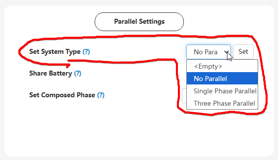

# Set System Type

## Призначення

Цей параметр визначає системну топологію роботи інвертора: чи працює він як самостійний (одиничний) пристрій, чи об'єднаний у паралельну систему з іншими інверторами для збільшення загальної вихідної потужності (в однофазну або трифазну конфігурацію)

## Доступ

| installer web | end-user web | mobile app | Display |
| :-----------: | :----------: | :--------: | :-----: |
|      ✅       |      🚫      |     🚫     |  ✅21   |

## Діапазон значень

- `No Parallel` (Без паралельного підключення / Одиничний інвертор)
- `Single Phase Parallel` (Однофазне паралельне підключення)
- `Three Phase Parallel` (Трифазне паралельне підключення)

## Рекомендовані значення

- `No Parallel` коли використовується лише один інвертор
- `Single Phase Parallel` коли кілька інверторів об'єднані для живлення однієї потужної фази
- `Three Phase Parallel` для створення трифазної мережі з трьох або більше інверторів
- За замовчуванням: `No Parallel`

## Oбмеження

- Може бути змінене лише у standby режимі або в стані fault.
- Для коректної паралельної роботи недостатньо просто змінити це налаштування. Фізичне об'єднання інверторів вимагає обов'язкового підключення комунікаційних паралельних кабелів (стандартний прямий RJ45) між портами Parallel та правильного налаштування апаратних DIP-перемикачів (перемикачі на першому та останньому інверторі в ланцюгу мають бути в положенні ON, а на всіх проміжних — OFF)
  > [!Warning] УВАГА!
  > Категорично заборонено паралелити входи сонячних панелей (PV) - кожен інвертор повинен мати власні незалежні стрінги.

## Коли змінювати

Під час пусконалагоджувальних робіт, якщо ви фізично додаєте та об'єднуєте кілька інверторів для спільної роботи.
