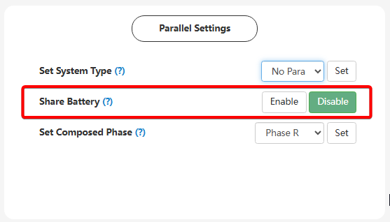

# Share Battery

## Призначення

Використовується в паралельних системах (коли два або більше інверторів об'єднані для збільшення потужності або створення трифазної мережі). Воно вказує системі, чи підключені всі паралельні інвертори до єдиного спільного масиву акумуляторних батарей (спільної шини постійного струму DC), чи кожен інвертор має свою власну незалежну батарейну збірку.

## Доступ

| installer web | end-user web | mobile app | Display |
| :-----------: | :----------: | :--------: | :-----: |
|      ✅       |      🚫      |     🚫     |  ✅21   |

## Діапазон значень

- Вибір з двох станів: `Disable` (Вимкнено) або `Enable` (Увімкнено)
- За замовчуванням: `Disable` (Вимкнено)

## Рекомендовані значення

- `Disable` (Вимкнено) коли використовується лише один інвертор.
- `Enable` (Увімкнено), якщо у вас встановлено кілька інверторів у паралельному режимі, підключених до однієї спільної стійки акумуляторів.
  > Для паралельних однофазних та трифазних систем спільна батарея дозволяє краще балансувати навантаження, подовжує термін служби акумуляторів та підвищує надійність системи.

## Обмеження

Якщо ви активуєте `Share Battery` -> `Enable` при використанні літієвих батарей з комунікацією, кабель зв'язку (CAN/RS485) від головної батареї (Master) повинен підключатися ТІЛЬКИ до головного інвертора (Master) у паралельному ланцюзі. Підлеглі інвертори (Slaves) не повинні мати підключених кабелів комунікації до батареї — вони отримуватимуть усі дані про рівень заряду та ліміти струмів по внутрішній паралельній шині від головного інвертора.

## Коли змінювати

Лише під час пусконалагоджувальних робіт при об'єднанні кількох інверторів у паралельну систему (якщо вони фізично підключені до спільних клем батареї). Для одиничного інвертора (`Set System Type` -> `No Parallel`) цей параметр не використовується і залишається вимкненим.
