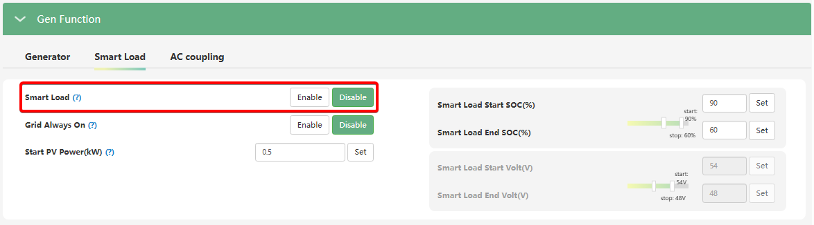

# Smart Load (Розумне навантаження)

## Призначення

Ця функція перепрофілює порт генератора (GEN) на **додатковий керований вихід для навантаження (Loads Port)**. Інвертор подаватиме живлення на підключені до цього порту прилади відповідно до налаштованих вами умов (наявність мережі, надлишок сонця або рівень заряду батареї).

Головна мета функції Smart Load — автоматично вмикати "другорядні" навантаження (наприклад, бойлер для нагріву води, тепловий насос або зарядний пристрій для електромобіля), коли акумулятор достатньо заряджений, а сонячної енергії в надлишку. Коли ж сонячна генерація падає або заряд батареї знижується, порт автоматично знеструмлюється, щоб зберегти енергію для критично важливих приладів, підключених до основного порту EPS.

## Доступ

| Installer Web | End-User Web | Mobile App | Display (LCD) |
| :-----------: | :----------: | :--------: | :-----------: |
|      ✅       |      ?       |     ?      |     ✅ 31     |

_(На РК-дисплеї інвертора увімкнення та всі пов'язані параметри цієї функції знаходяться під індексом **31**)._

## Діапазон значень та пов'язані параметри

Для гнучкого керування портом використовується група налаштувань,,:

- **Smart Load:** `Enable` (Увімкнути) / `Disable` (Вимкнути).
- **Smart Load GridOn (Grid Always On):** Якщо увімкнено, "розумне навантаження" матиме безперебійне живлення завжди, коли є зовнішня електромережа.
- **Smart Load PV Power (kW):** Поріг потужності сонячних панелей (від 0 до 25.5 кВт), при перевищенні якого порт увімкнеться.
- **Smart Load Start Volt(V) / SOC(%):** Рівень заряду батареї або напруга (за замовчуванням 90% або 54.0 В), при досягненні якого порт увімкнеться.
- **Smart Load End Volt(V) / SOC(%):** Рівень заряду батареї або напруга (за замовчуванням 60% або 48.0 В), при падінні до якого порт вимкнеться.

## Логіка роботи

1. **Робота з мережею:** Якщо активовано `Grid Always On`, порт GEN працюватиме як звичайна розетка, поки є світло в міській мережі.
2. **Автономна робота (або якщо Grid Always On вимкнено):** Порт подасть напругу на навантаження лише тоді, коли поточна генерація сонця перевищує заданий поріг `Start PV Power`, **АБО** коли заряд батареї досягне порогу `Smart Load Start SOC`.
3. **Захисне вимкнення:** Щойно заряд батареї впаде до значення `Smart Load End SOC` (наприклад, ввечері або при хмарній погоді), живлення порту миттєво припиниться.

## Примітки та критичні обмеження

> [!WARNING] ЗАБОРОНА ПІДКЛЮЧЕННЯ ДЖЕРЕЛ СТРУМУ:
> Як наголошує виробник: якщо ви увімкнули функцію Smart Load, **суворо заборонено** підключати до цього порту генератор або мережевий інвертор (AC Couple). У режимі Smart Load порт працює на **ВИДАЧУ** напруги. Якщо в цей час генератор заведеться і подасть зустрічну напругу в порт, пристрій буде миттєво і незворотно пошкоджено! Функції порту (Генератор, Smart Load, AC Coupling) є взаємовиключними.

## Коли змінювати:

Вмикайте та налаштовуйте Smart Load, коли ваша сонячна станція генерує більше енергії, ніж ви встигаєте споживати (особливо влітку), і ви хочете автоматизувати безкоштовне нагрівання води чи зарядку електротранспорту, не витрачаючи при цьому резерв батареї, потрібний для нічного часу.
