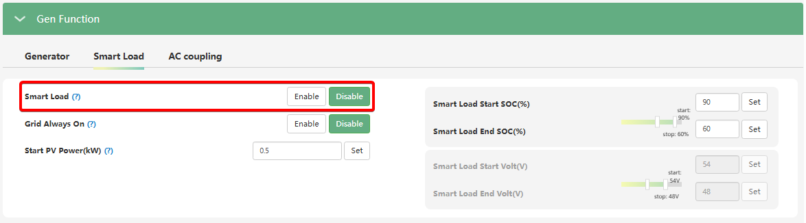

# Smart Load (Розумне навантаження)

## Призначення

Ця функція перепрофілює порт генератора (GEN) на **додатковий керований вихід для навантаження (Loads Port)**. Інвертор подаватиме живлення на підключені до цього порту прилади відповідно до налаштованих вами умов: наявність мережі (якщо увімкнено `Grid Always On`), або поєднання рівня заряду батареї та наявності сонця.

Головна мета функції Smart Load — автоматично вмикати "другорядні" навантаження (наприклад, бойлер для нагріву води, тепловий насос або зарядний пристрій для електромобіля), коли акумулятор достатньо заряджений, а сонячної енергії в надлишку. Коли ж сонячна генерація падає або заряд батареї знижується, порт автоматично знеструмлюється, щоб зберегти енергію для критично важливих приладів, підключених до основного порту EPS.

## Доступ

| Installer Web | End-User Web | Mobile App | Display (LCD) |
| :-----------: | :----------: | :--------: | :-----------: |
|      ✅       |      ?       |     ?      |     ✅ 31     |

_(На РК-дисплеї інвертора увімкнення та всі пов'язані параметри цієї функції знаходяться під індексом **31**)._

## Діапазон значень та пов'язані параметри

Для гнучкого керування портом використовується група налаштувань:

- **Smart Load:** `Enable` (Увімкнути) / `Disable` (Вимкнути).
- **[Smart Load GridOn (Grid Always On)](/settings/smart_load_grid_always_on):** Якщо увімкнено, "розумне навантаження" матиме безперебійне живлення завжди, коли є зовнішня електромережа.
- **[Smart Load PV Power (kW)](/settings/smart_load_start_pv_power_kw):** Поріг потужності сонячних панелей (від 0 до 25.5 кВт). Генерація понад цей поріг потрібна для роботи порту за будь-якого рівня заряду батареї (якщо порт не живиться від мережі через `Grid Always On`).
- **[Smart Load Start Volt(V) / SOC(%)](/settings/smart_load_start_stop):** Рівень заряду батареї або напруга (за замовчуванням 90% або 54.0 В), при досягненні якого вимкнений порт увімкнеться (за наявності сонця).
- **[Smart Load End Volt(V) / SOC(%)](/settings/smart_load_start_stop):** Рівень заряду батареї або напруга (за замовчуванням 60% або 48.0 В), при падінні до якого порт вимкнеться безумовно, навіть якщо сонце є.

## Логіка роботи

> [!NOTE] Перевірено практично
> Описана нижче логіка відтворена за практичними тестами користувача на прошивці `cBaa-33919A` (зі значенням `Start PV Power` = 0 кВт, керування за SOC). Пункти з позначкою _«потребує перевірки»_ ще не підтверджені окремими тестами.

**А. Мережа є, і `Grid Always On` = `Enable`.** Порт GEN працює як звичайна розетка, поки є світло в міській мережі, незалежно від сонця і рівня заряду батареї.

**Б. Мережі немає (автономний режим), або `Grid Always On` = `Disable`.** Генерація сонця понад `Start PV Power` є **обов'язковою умовою за будь-якого SOC**, навіть 100%. Поверх цієї умови працює гістерезис за рівнем заряду батареї: стан порту залежить не лише від поточного SOC, а й від того, чи був порт увімкнений до цього:

| SOC батареї                     | Порт був **увімкнений**                                                                              | Порт був **вимкнений**                                                                                                     |
| :------------------------------ | :--------------------------------------------------------------------------------------------------- | :------------------------------------------------------------------------------------------------------------------------- |
| **≥ `Start SOC`**               | Тримається, поки генерація перевищує `Start PV Power`. Без сонця вимикається через 1–2 хв          | Вмикається одразу, щойно генерація перевищує `Start PV Power`                                                              |
| **між `End SOC` і `Start SOC`** | Тримається, поки генерація перевищує `Start PV Power`. Без сонця вимикається через 1–2 хв          | **Залишається вимкненим, навіть якщо сонце є.** Увімкнеться лише після досягнення `Start SOC` (_повторна перевірка запланована_) |
| **≤ `End SOC`**                 | Вимикається, навіть якщо сонце є                                                                     | Залишається вимкненим                                                                                                      |

Тобто умови по сонцю та по заряду батареї працюють разом (**І**), а не як альтернативи (**АБО**).

Додаткові особливості:

- **Затримка вимкнення та миттєве увімкнення.** При зникненні сонця порт вимикається не миттєво, а через 1–2 хвилини (спостерігалось у режимі з мережею та `Grid Always On` = `Disable`, а також при SOC 100%). При поверненні сонця (якщо SOC ≥ `Start SOC`) порт вмикається одразу, без затримки. Чи така ж затримка в автономному режимі без мережі — _потребує перевірки_.
- **Вимкнення `Grid Always On` скидає стан порту.** Якщо порт живився від мережі завдяки `Grid Always On`, і ви вимкнули цей параметр, порт знеструмлюється і чекатиме, поки SOC досягне `Start SOC` (якщо SOC вже вищий і є сонце — порт залишиться увімкненим). Живлення від мережі через `Grid Always On` не "запам'ятовується" гістерезисом.
- **Без мережі параметр `Grid Always On` ні на що не впливає** — поведінка порту однакова при `Enable` і `Disable`.
- **Керування за напругою (`Volt`)** замість SOC, ймовірно, працює так само — _потребує перевірки_.

### Практичні наслідки

1. **`Start PV Power` = 0 не означає "керування тільки за SOC".** Коли сонця немає (ніч, хмара), генерація дорівнює нулю, тобто не перевищує поріг 0 — і порт вимикається за будь-якого SOC.
2. **Хмара може вимкнути порт надовго.** Якщо сонце зникло, коли заряд був між `End` і `Start`, порт вимкнеться, а коли сонце повернеться — сам не увімкнеться. Наступне увімкнення відбудеться лише після того, як батарея знову зарядиться до `Start SOC`.
3. **Вночі порт не працює взагалі.** Без сонця порт вимикається за будь-якого SOC, навіть 100%. Поріг `End SOC` — це нижня межа лише для роботи вдень, коли є генерація. Вночі Smart Load може живити навантаження тільки від мережі (через `Grid Always On`).
4. **Порт не увімкнеться ніколи, якщо батарея не може досягти `Start SOC`** — наприклад, якщо [System Charge SOC Limit](/settings/system_charge_soc_limit) встановлено нижче за `Start SOC`. _(Логічний висновок — потребує перевірки.)_

### Поведінка при блекауті

- **Мережа зникла вдень при сонці, SOC між `End` і `Start`, порт був увімкнений** — порт продовжує працювати, поки є сонце і SOC вище `End SOC`.
- **Мережа зникла, SOC між `End` і `Start`, сонця немає** — порт знеструмлюється, навіть якщо в батареї ще багато енергії.
- **Мережа зникла ввечері (без сонця), SOC ≥ `Start SOC`, порт живився від мережі (`Grid Always On` = `Enable`)** — згідно з моделлю, порт вимкнеться через 1–2 хв, оскільки сонця немає. _(Суперечливі дані — потребує перевірки: в одному з тестів при SOC 100% напруга на порту залишилась після зникнення мережі, але, ймовірно, спостереження було коротшим за затримку вимкнення.)_

Висновок: Smart Load добре підходить для скидання надлишків сонячної енергії вдень, але як "розумний" вихід для блекаутів він не підходить: без сонця порт знеструмлюється навіть при повній батареї.

## Примітки та критичні обмеження

> [!WARNING] ЗАБОРОНА ПІДКЛЮЧЕННЯ ДЖЕРЕЛ СТРУМУ:
> Як наголошує виробник: якщо ви увімкнули функцію Smart Load, **суворо заборонено** підключати до цього порту генератор або мережевий інвертор (AC Couple). У режимі Smart Load порт працює на **ВИДАЧУ** напруги. Якщо в цей час генератор заведеться і подасть зустрічну напругу в порт, пристрій буде миттєво і незворотно пошкоджено! Функції порту (Генератор, Smart Load, AC Coupling) є взаємовиключними.

## Коли змінювати:

Вмикайте та налаштовуйте Smart Load, коли ваша сонячна станція генерує більше енергії, ніж ви встигаєте споживати (особливо влітку), і ви хочете автоматизувати безкоштовне нагрівання води чи зарядку електротранспорту, не витрачаючи при цьому резерв батареї, потрібний для нічного часу.
