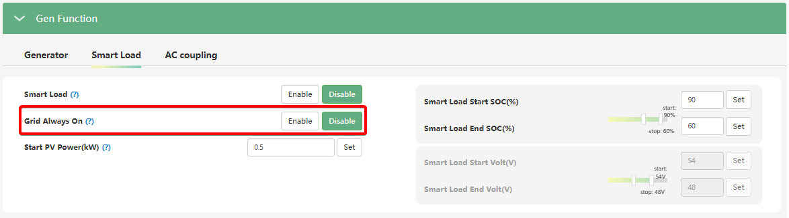

# Smart Load -> Grid Always On

###### (Увімкнення за наявності мережі)

## Призначення

Цей параметр є частиною функції "Розумного навантаження" (Smart Load). Він визначає, чи буде порт генератора (GEN), який налаштовано як додатковий вихід, отримувати безперервне живлення весь час, поки доступна зовнішня електромережа (Grid).

## Доступ

| Installer Web | End-User Web | Mobile App | Display (LCD) |
| :-----------: | :----------: | :--------: | :-----------: |
|      ✅       |      ?       |     ?      |     ✅ 31     |

_(На РК-дисплеї інвертора ця функція налаштовується в меню **31** під назвою `Smart Load GridOn`)._

## Діапазон значень

- **`Disable` (Вимкнено):** Значення за замовчуванням. Живлення на порт Smart Load подається **виключно** за умов наявності надлишку сонячної енергії (PV) або достатнього рівня заряду батареї, які ви налаштували раніше, незалежно від того, чи є напруга в міській мережі.
- **`Enable` (Увімкнено):** Коли підключено до мережі, розумне навантаження залишається безперервно підключеним до живлення (порт працює в режимі наскрізного пропускання).

## Логіка роботи

Цей параметр розділяє логіку роботи порту на два сценарії:

1. **Мережа присутня (Grid On):** Якщо функцію увімкнено (`Enable`), порт Smart Load працює як звичайна домашня розетка. Інвертор просто пропускає струм з мережі на підключений прилад (наприклад, бойлер або кондиціонер), тимчасово ігноруючи налаштування сонячної потужності (`Start PV Power`) та відсотків заряду батареї (`Smart Load SOC`).
2. **Мережа відсутня (Grid Off / Блекаут):** Щойно міська мережа зникає, інвертор миттєво переходить до класичного алгоритму Smart Load. Відтепер порт матиме живлення лише тоді, коли вистачає сонця або заряду батареї (вище порогу `Start SOC` / `Start Volt`). Якщо заряду стає мало — порт знеструмлюється для економії енергії на користь головного порту EPS.

## Примітки та важливі обмеження

> [!WARNING] **Сумісність функцій порту:**
> Використання порту GEN в режимі Smart Load (навіть з увімкненим Grid Always On) забороняє одночасне підключення до цього ж порту паливного генератора або мережевого інвертора (AC Coupling). Якщо зустрічна напруга потрапить на цей порт під час роботи функції Smart Load, це може призвести до пошкодження пристрою.

## Коли змінювати:

- **Встановлюйте `Disable`**, якщо ваша головна мета — **максимальна економія**. У цьому режимі ваш бойлер чи зарядка електромобіля працюватимуть _тільки_ тоді, коли є безкоштовна сонячна енергія, і ніколи не споживатимуть платну енергію з міської мережі (навіть коли вона є).
- **Встановлюйте `Enable`**, якщо до порту Smart Load підключено прилад для комфорту (наприклад, кондиціонер або той самий бойлер), і ви хочете, щоб він гарантовано працював у звичайному режимі від мережі вночі або в похмуру погоду. А от під час блекаутів цей прилад ставатиме "другорядним" і працюватиме лише за умови надлишку сонця чи достатнього заряду в батареях.
