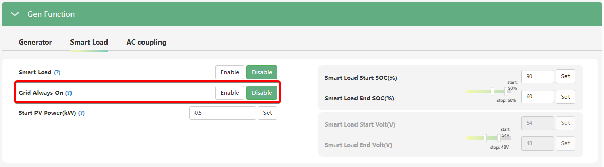

# Smart Load -> Grid Always On

###### (Увімкнення за наявності мережі)

## Призначення

Цей параметр є частиною функції "Розумного навантаження" (Smart Load). Він визначає, чи буде порт генератора (GEN), який налаштовано як додатковий вихід, отримувати безперервне живлення весь час, поки доступна зовнішня електромережа (Grid).

## Доступ

| Installer Web | End-User Web | Mobile App | Display (LCD) |
| :-----------: | :----------: | :--------: | :-----------: |
|      ✅       |      ?       |     ?      |     ✅ 31     |

_(На РК-дисплеї інвертора ця функція налаштовується в меню **31** під назвою `Smart Load GridOn`)._

## Діапазон значень

- **`Disable` (Вимкнено):** Значення за замовчуванням. Живлення на порт Smart Load подається **виключно** за умовами по рівню заряду батареї та сонячній генерації (PV), які ви налаштували раніше, незалежно від того, чи є напруга в міській мережі.
- **`Enable` (Увімкнено):** Коли підключено до мережі, розумне навантаження залишається безперервно підключеним до живлення (порт працює в режимі наскрізного пропускання).

## Логіка роботи

Цей параметр розділяє логіку роботи порту на два сценарії:

1. **Мережа присутня (Grid On):** Якщо функцію увімкнено (`Enable`), порт Smart Load працює як звичайна домашня розетка. Інвертор просто пропускає струм з мережі на підключений прилад (наприклад, бойлер або кондиціонер), тимчасово ігноруючи налаштування сонячної потужності (`Start PV Power`) та відсотків заряду батареї (`Smart Load SOC`).
2. **Мережа відсутня (Grid Off / Блекаут):** Щойно міська мережа зникає, інвертор переходить до класичного алгоритму Smart Load (гістерезис за SOC з умовою по сонцю — див. таблицю на сторінці [Smart Load](/settings/smart_load#логіка-роботи)). Без мережі значення `Grid Always On` ні на що не впливає: поведінка порту однакова при `Enable` і `Disable`. Що відбувається з портом у момент зникнення мережі:
   - **SOC ≥ `Start SOC`:** порт залишається під напругою, навіть якщо сонця немає (спостерігалось при SOC 100% під час імітації вечірнього відключення). Згідно з моделлю, він вимкнеться, щойно SOC опуститься нижче `Start SOC`, — _потребує перевірки_.
   - **SOC між `End SOC` і `Start SOC`, сонце є (понад `Start PV Power`):** порт залишається під напругою, поки є сонце і SOC вище `End SOC`.
   - **SOC між `End SOC` і `Start SOC`, сонця немає:** порт знеструмлюється, хоча в батареї ще може бути багато енергії.
   - **SOC ≤ `End SOC`:** порт знеструмлюється незалежно від сонця.

> [!NOTE] Перевірено практично
> Описана поведінка відтворена за практичними тестами користувача на прошивці `cBaa-33919A`.

## Примітки та важливі обмеження

> [!WARNING] Сумісність функцій порту:
> Використання порту GEN в режимі Smart Load (навіть з увімкненим Grid Always On) забороняє одночасне підключення до цього ж порту паливного генератора або мережевого інвертора (AC Coupling). Якщо зустрічна напруга потрапить на цей порт під час роботи функції Smart Load, це може призвести до пошкодження пристрою.

> [!WARNING] Вимкнення параметра скидає стан порту:
> Живлення порту від мережі через `Grid Always On` не "запам'ятовується" гістерезисом Smart Load. Якщо порт живився від мережі і ви перемкнули параметр на `Disable`, порт знеструмиться і чекатиме, поки SOC досягне `Smart Load Start SOC` (якщо SOC вже вищий — порт залишиться під напругою). Повернення сонця саме по собі його не увімкне.

## Коли змінювати:

- **Встановлюйте `Disable`**, якщо ваша головна мета — **максимальна економія**. У цьому режимі ваш бойлер чи зарядка електромобіля працюватимуть _тільки_ тоді, коли є безкоштовна сонячна енергія, і ніколи не споживатимуть платну енергію з міської мережі (навіть коли вона є).
- **Встановлюйте `Enable`**, якщо до порту Smart Load підключено прилад для комфорту (наприклад, кондиціонер або той самий бойлер), і ви хочете, щоб він гарантовано працював у звичайному режимі від мережі вночі або в похмуру погоду. А от під час блекаутів цей прилад ставатиме "другорядним": вдень він працюватиме за наявності сонця, поки SOC вище `End SOC`, а вночі (без сонця) — лише поки SOC не нижче `Start SOC`. Для роботи другорядного навантаження під час блекауту аж до заданого порогу розряду батареї функція Smart Load підходить обмежено.
