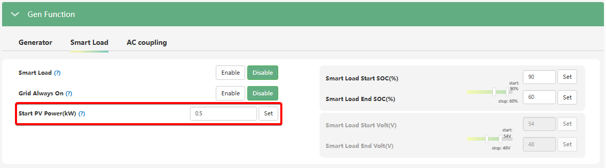

# Start PV Power (kW)

## Призначення

Цей параметр визначає мінімальний поріг поточної потужності генерації від сонячних панелей (у кіловатах), при перевищенні якого інвертор дозволить подати живлення на порт розумного навантаження (GEN/Smart Load).

Головна мета цього налаштування — гарантувати, що ваші додаткові потужні прилади (наприклад, бойлер або насос) вмикатимуться лише тоді, коли сонця дійсно вистачає для їхньої роботи. Це запобігає ситуаціям, коли "розумне навантаження" вмикається і починає розряджати батарею в умовах нестачі сонячної генерації.

## Доступ

| Installer Web | End-User Web | Mobile App | Display (LCD) |
| :-----------: | :----------: | :--------: | :-----------: |
|      ✅       |      ?       |     ?      |     ✅ 31     |

_(На РК-дисплеї інвертора цей параметр є підпунктом у меню **31** під назвою `Smart Load PV Power`)_.

## Діапазон значень

- **Мінімум:** 0 кВт.
- **Максимум:** 25.5 кВт.(?)
- **Крок:** 0.1 кВт.
- **За замовчуванням:** 0.5 кВт.

## Логіка роботи

Цей параметр працює як динамічний перемикач:

1. Інвертор постійно моніторить поточну потужність, яку видають сонячні панелі (PV Power).
2. Як тільки генерація сонця стає більшою за встановлене значення `Start PV Power (kW)`, система отримує перший дозвіл на увімкнення порту Smart Load.
3. У більшості конфігурацій цей параметр працює в логічній зв'язці з порогом заряду батареї (`Smart Load Start SOC / Volt`). Тобто, для оптимальної роботи розумного навантаження в автономному режимі, система чекає, поки _і батарея буде достатньо заряджена_, _і сонце буде видавати достатню потужність_.

## Примітки та важливі обмеження

> [!TIP] Узгодження з потужністю приладу:
> Важливо, щоб значення `Start PV Power` відповідало (або було трохи більшим) за номінальну потужність приладу, підключеного до порту Smart Load. Наприклад, якщо ваш ТЕН у бойлері споживає 2.0 кВт, немає сенсу ставити старт від сонця на 0.5 кВт. Якщо ви залишите 0.5 кВт, порт увімкнеться рано-вранці, але оскільки сонце дає лише 500 Вт, решту 1.5 кВт для бойлера інвертор одразу почне "висмоктувати" з вашої батареї.

> [!NOTE] Ігнорування при Grid Always On:
> Якщо ви увімкнули попередній параметр `Grid Always On` і в міській мережі є напруга, то ліміт `Start PV Power` тимчасово ігнорується. Порт працюватиме безупинно від мережі. Логіка генерації сонця активується лише під час блекаутів або якщо `Grid Always On` вимкнено.

## Коли змінювати:

Налаштовуйте цей параметр одразу після фізичного підключення "розумного навантаження".

- **Якщо ви підключили водонагрівач на 1.5 кВт:** встановіть `Start PV Power` на рівні `1.5 - 2.0 кВт`. Таким чином, бойлер увімкнеться лише в ясний день, коли сонця достатньо, щоб повністю покрити його споживання, і при цьому не забирати енергію, яка потрібна для живлення основного будинку (порту EPS).
- **Якщо ви хочете, щоб порт вмикався виключно за рівнем заряду батареї** (незалежно від того, чи світить сонце, чи ні), ви можете встановити цей параметр на `0 кВт`.
