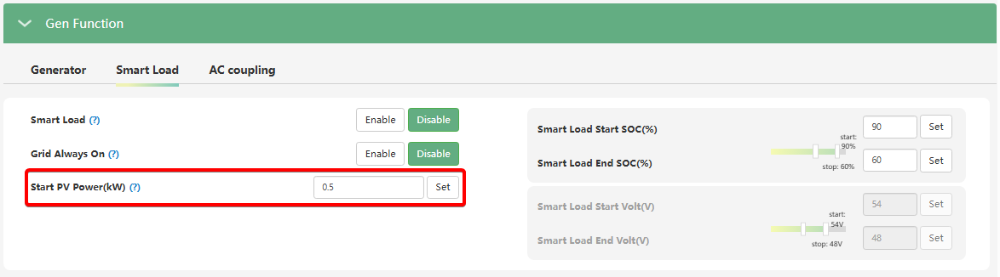

# Start PV Power (kW)

## Призначення

Цей параметр визначає мінімальний поріг поточної потужності генерації від сонячних панелей (у кіловатах), без якого порт розумного навантаження (GEN/Smart Load) не працює, коли заряд батареї знаходиться між порогами `Smart Load End SOC` і `Smart Load Start SOC` (якщо порт не живиться від мережі через `Grid Always On`). Вище `Start SOC` порт працює і без сонця.

Головна мета цього налаштування — гарантувати, що ваші додаткові потужні прилади (наприклад, бойлер або насос) вмикатимуться лише тоді, коли сонця дійсно вистачає для їхньої роботи. Це запобігає ситуаціям, коли "розумне навантаження" вмикається і починає розряджати батарею в умовах нестачі сонячної генерації.

## Доступ

| Installer Web | End-User Web | Mobile App | Display (LCD) |
| :-----------: | :----------: | :--------: | :-----------: |
|      ✅       |      ?       |     ?      |     ✅ 31     |

_(На РК-дисплеї інвертора цей параметр є підпунктом у меню **31** під назвою `Smart Load PV Power`)_.

## Діапазон значень

- **Мінімум:** 0 кВт.
- **Максимум:** 25.5 кВт.(?)
- **Крок:** 0.1 кВт.
- **За замовчуванням:** 0.5 кВт.

## Логіка роботи

Цей параметр працює в логічній зв'язці (**І**) з порогами заряду батареї [Smart Load Start / End SOC](/settings/smart_load_start_stop). Повна таблиця станів наведена на сторінці [Smart Load](/settings/smart_load#логіка-роботи).

1. Інвертор постійно моніторить поточну потужність, яку видають сонячні панелі (PV Power).
2. **Вище `Start SOC`:** Порт працює незалежно від сонця — цей параметр не діє (підтверджено двома тестами при SOC 100%).
3. **Утримання порту між `End SOC` і `Start SOC`:** Порт залишається під напругою, лише поки генерація перевищує `Start PV Power`. Щойно генерація падає до порогу або нижче (хмара, вечір), порт вимикається через 1–2 хвилини.
4. **Повторне увімкнення:** Коли генерація знову перевищує `Start PV Power`, порт вмикається **одразу**, без затримки — якщо після останнього досягнення `Start SOC` заряд не опускався до `End SOC` (тимчасова відсутність сонця "дозвіл" на роботу порту не скидає).
5. **Після падіння до `End SOC`:** Порт вимикається незалежно від сонця, а дозвіл скидається. Повернення сонця саме по собі порт не вмикає — він увімкнеться лише після того, як батарея знову зарядиться до `Start SOC` (_потребує перевірки_).

> [!NOTE] Перевірено практично
> Пункти 2–4 відтворені за практичними тестами користувача на прошивці `cBaa-33919A` зі значенням `Start PV Power` = 0 кВт. Затримка вимкнення 1–2 хв спостерігалась у режимі з мережею та `Grid Always On` = `Disable`, а також у тесті, умови якого щодо мережі не уточнені; чи така ж затримка в автономному режимі без мережі — _потребує перевірки_.

## Примітки та важливі обмеження

> [!TIP] Узгодження з потужністю приладу:
> Важливо, щоб значення `Start PV Power` відповідало (або було трохи більшим) за номінальну потужність приладу, підключеного до порту Smart Load. Наприклад, якщо ваш ТЕН у бойлері споживає 2.0 кВт, немає сенсу ставити старт від сонця на 0.5 кВт. Якщо ви залишите 0.5 кВт, порт залишатиметься увімкненим і при слабкому сонці (наприклад, увечері або в хмарність), але оскільки сонце дає лише 500 Вт, решту 1.5 кВт для бойлера інвертор почне "висмоктувати" з вашої батареї.

> [!NOTE] Ігнорування при Grid Always On:
> Якщо ви увімкнули попередній параметр `Grid Always On` і в міській мережі є напруга, то ліміт `Start PV Power` тимчасово ігнорується. Порт працюватиме безупинно від мережі. Логіка генерації сонця активується лише під час блекаутів або якщо `Grid Always On` вимкнено.

## Коли змінювати:

Налаштовуйте цей параметр одразу після фізичного підключення "розумного навантаження".

- **Якщо ви підключили водонагрівач на 1.5 кВт:** встановіть `Start PV Power` на рівні `1.5 - 2.0 кВт`. Таким чином, бойлер увімкнеться лише в ясний день, коли сонця достатньо, щоб повністю покрити його споживання, і при цьому не забирати енергію, яка потрібна для живлення основного будинку (порту EPS).
- **Значення `0 кВт`** означає, що для утримання порту достатньо будь-якої генерації. Але це **не** перетворює Smart Load на керування виключно за рівнем заряду батареї: коли сонця немає зовсім (вночі, у густу хмарність), генерація дорівнює нулю й не перевищує поріг — і порт вимкнеться, якщо SOC нижчий за `Start SOC`. Без сонця порт працює лише поки SOC ≥ `Start SOC`.
