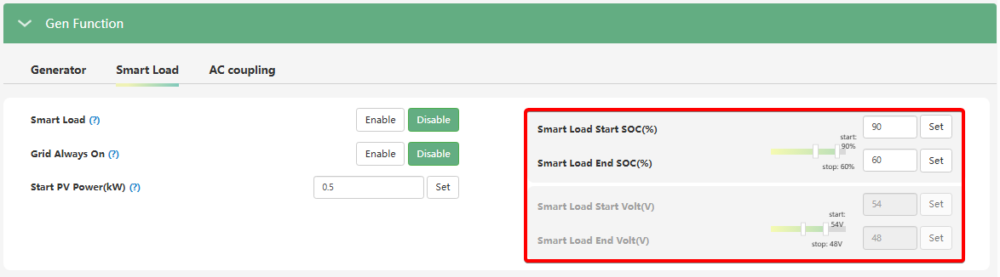

# Smart Load Start SOC(%) / Volt(V) та Smart Load End SOC(%) / Volt(V)

## Призначення

Ці дві пари параметрів працюють разом і визначають верхній (`Start`) та нижній (`End`) пороги рівня заряду акумулятора (у відсотках або Вольтах), за якими інвертор автоматично вмикає або знеструмлює порт розумного навантаження (Smart Load).

Головна мета цих налаштувань — дозволити системі автоматично живити другорядні потужні прилади лише тоді, коли батарея достатньо заряджена, і гарантовано вимикати їх, щойно заряд почне падати. Це запобігає виснаженню акумулятора і гарантує, що основний резерв енергії залишиться для живлення критично важливих приладів будинку на порту EPS.

## Доступ

| Installer Web | End-User Web | Mobile App | Display (LCD) |
| :-----------: | :----------: | :--------: | :-----------: |
|      ✅       |      ?       |     ?      |     ✅ 31     |

_(На РК-дисплеї інвертора ці параметри є підпунктами комплексного меню **31**)_.

## Діапазон значень та налаштування за замовчуванням

Як і з іншими налаштуваннями батареї, ви використовуєте `SOC (%)` для літієвих батарей із підключеною комунікацією (BMS), або `Volt (V)` для свинцево-кислотних чи некерованих літієвих збірок.

**Пороги увімкнення (Smart Load Start):**

- **SOC (%):** 0% – 100%. (За замовчуванням: **90%**).
- **Volt (V):** 40.0 В – 59.0 В. (За замовчуванням: **54.0 В**).

**Пороги вимкнення (Smart Load End):**

- **SOC (%):** 0% – 100%. (За замовчуванням: **60%**).
- **Volt (V):** 40.0 В – 59.0 В. (За замовчуванням: **48.0 В**).

## Логіка роботи

Ці параметри створюють робоче "вікно" для вашого розумного навантаження в автономному режимі (або коли опція `Grid Always On` вимкнена):

1. **Увімкнення:** Порт GEN/Smart Load подасть напругу на ваш бойлер, коли заряд батареї підніметься до встановленого значення `Smart Load Start SOC` (наприклад, 90%).
2. **Робота:** Прилад продовжуватиме працювати, поки заряд акумулятора знаходиться в межах від 90% до 60%.
3. **Вимкнення:** Якщо сонце сховається за хмари, і бойлер почне витягувати енергію з акумулятора, то при падінні рівня заряду до `Smart Load End SOC` (наприклад, 60%), інвертор знеструмить цей порт. Таким чином, у вас в батареї гарантовано залишиться 60% заряду на вечір.

## Примітки та важливі особливості

> [!NOTE] Ігнорування при наявності мережі (Grid Always On):
> Якщо ви активували функцію `Grid Always On`, то за наявності світла в міській мережі пороги `Start` та `End` тимчасово ігноруються — порт просто постійно живиться від мережі. Зазначена логіка за рівнем заряду батареї почне працювати лише тоді, коли мережа зникне (блекаут).

> [!TIP] Сумісна робота зі Start PV Power:
> Інвертор дозволяє налаштувати гібридну умову старту. Ви можете вказати поріг потужності сонячних панелей (`Start PV Power`), а також поріг заряду батареї (`Start SOC / Volt`). Порт "прокинеться", якщо виконається умова по сонцю АБО якщо батарея зарядиться до достатнього рівня.

## Коли змінювати:

Налаштовуйте ці параметри відповідно до ємності вашої батареї та того, скільки енергії ви готові пожертвувати на комфорт:

- **Для максимальної надійності:** Встановіть `Start SOC` на 95-100%, а `End SOC` на 80-85%. Тоді водонагрівач чи кондиціонер будуть працювати лише на самих "піках" заряду акумулятора, гарантуючи, що батарея завжди залишатиметься майже повною.
- **Якщо у вас великий акумуляторний масив:** Ви можете розширити вікно, опустивши `End SOC` до 50% або 40%, дозволяючи системі глибше розряджати батарею вдень для нагріву води.
