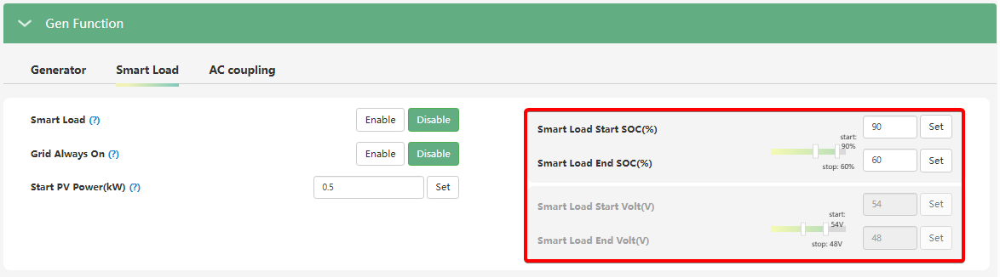

# Smart Load Start SOC(%) / Volt(V) та Smart Load End SOC(%) / Volt(V)

## Призначення

Ці дві пари параметрів працюють разом і визначають верхній (`Start`) та нижній (`End`) пороги рівня заряду акумулятора (у відсотках або Вольтах), за якими інвертор автоматично вмикає або знеструмлює порт розумного навантаження (Smart Load).

Головна мета цих налаштувань — дозволити системі автоматично живити другорядні потужні прилади лише тоді, коли батарея достатньо заряджена, і гарантовано вимикати їх, щойно заряд почне падати. Це запобігає виснаженню акумулятора і гарантує, що основний резерв енергії залишиться для живлення критично важливих приладів будинку на порту EPS.

## Доступ

| Installer Web | End-User Web | Mobile App | Display (LCD) |
| :-----------: | :----------: | :--------: | :-----------: |
|      ✅       |      ?       |     ?      |     ✅ 31     |

_(На РК-дисплеї інвертора ці параметри є підпунктами комплексного меню **31**)_.

## Діапазон значень та налаштування за замовчуванням

Як і з іншими налаштуваннями батареї, ви використовуєте `SOC (%)` для літієвих батарей із підключеною комунікацією (BMS), або `Volt (V)` для свинцево-кислотних чи некерованих літієвих збірок.

**Пороги увімкнення (Smart Load Start):**

- **SOC (%):** 0% – 100%. (За замовчуванням: **90%**).
- **Volt (V):** 40.0 В – 59.0 В. (За замовчуванням: **54.0 В**).

**Пороги вимкнення (Smart Load End):**

- **SOC (%):** 0% – 100%. (За замовчуванням: **60%**).
- **Volt (V):** 40.0 В – 59.0 В. (За замовчуванням: **48.0 В**).

## Логіка роботи

Ці параметри створюють гістерезис для вашого розумного навантаження в автономному режимі (або коли опція `Grid Always On` вимкнена). Повна таблиця станів наведена на сторінці [Smart Load](/settings/smart_load#логіка-роботи); нижче — приклад для `Start SOC` = 90% та `End SOC` = 60%:

1. **Увімкнення:** Коли заряд батареї піднімається до `Smart Load Start SOC` (90%), порт GEN/Smart Load подає напругу на ваш бойлер, а інвертор запам'ятовує "дозвіл" на роботу порту.
2. **Робота вище `Start SOC` (90–100%):** Порт працює **навіть без сонця** (підтверджено тестами при SOC 100%).
3. **Робота між порогами (від 90% до 60%):** Порт працює, **лише поки генерація сонця перевищує `Start PV Power`**. Якщо сонце сховається за хмари або настане вечір, порт вимкнеться через 1–2 хв. Коли сонце повернеться, порт **одразу** увімкнеться знову — дозвіл при цьому не скидається, тож повторно досягати 90% не потрібно.
4. **Безумовне вимкнення:** При падінні рівня заряду до `Smart Load End SOC` (60%) порт знеструмлюється, навіть якщо сонце є, а дозвіл скидається. Після цього порт не увімкнеться, навіть якщо сонця достатньо, доки SOC знову не досягне 90% (_потребує перевірки_).

Отже, `End SOC` — це нижня межа для роботи **вдень при сонці**. Вночі (без сонця) порт працює лише поки SOC ≥ `Start SOC` і вимкнеться, щойно заряд опуститься нижче (_потребує перевірки_). Тому в батареї на ніч залишиться не менше 60%, а фактично — не менше `Start SOC` або стільки, скільки було на момент заходу сонця.

## Примітки та важливі особливості

> [!NOTE] Перевірено практично
> Логіка відтворена за практичними тестами користувача на прошивці `cBaa-33919A` з керуванням за SOC. Чи так само працюють пороги за напругою (`Volt`) — _потребує перевірки_.

> [!NOTE] Ігнорування при наявності мережі (Grid Always On):
> Якщо ви активували функцію `Grid Always On`, то за наявності світла в міській мережі пороги `Start` та `End` тимчасово ігноруються — порт просто постійно живиться від мережі. Зазначена логіка за рівнем заряду батареї почне працювати лише тоді, коли мережа зникне (блекаут).
>
> Живлення від мережі не "запам'ятовується" гістерезисом: якщо вимкнути `Grid Always On`, коли SOC знаходиться між `End` і `Start`, порт знеструмиться і чекатиме досягнення `Start SOC`.

> [!TIP] Сумісна робота зі Start PV Power:
> Між порогами `End` і `Start` умови по сонцю та по заряду батареї працюють разом (**І**), а не як альтернативи: порт працює лише за наявності генерації понад [Start PV Power](/settings/smart_load_start_pv_power_kw). Навіть при значенні `Start PV Power` = 0 кВт відсутність сонця (вночі) вимикає порт, якщо SOC нижчий за `Start SOC`. Вище `Start SOC` сонце не потрібне.

> [!WARNING] Start SOC має бути досяжним:
> Якщо дозвіл скинутий і батарея не може зарядитися до `Start SOC` — наприклад, через обмеження [System Charge SOC Limit](/settings/system_charge_soc_limit) нижче за `Start SOC` — порт за рівнем заряду не увімкнеться ніколи. _(Логічний висновок — потребує перевірки.)_

## Коли змінювати:

Налаштовуйте ці параметри відповідно до ємності вашої батареї та того, скільки енергії ви готові пожертвувати на комфорт:

- **Для максимальної надійності:** Встановіть `Start SOC` на 95-100%, а `End SOC` на 80-85%. Тоді водонагрівач чи кондиціонер будуть працювати лише на самих "піках" заряду акумулятора, гарантуючи, що батарея завжди залишатиметься майже повною.
- **Якщо у вас великий акумуляторний масив:** Ви можете розширити вікно, опустивши `End SOC` до 50% або 40%, дозволяючи системі глибше розряджати батарею вдень для нагріву води.
