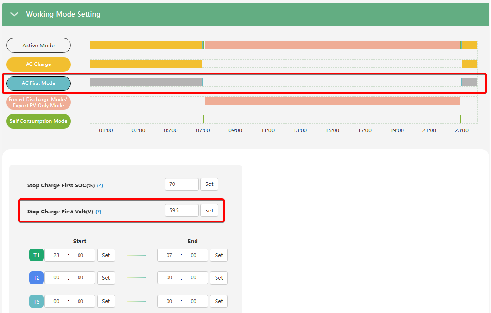

# Stop Charge First Volt (V)

## Призначення

Цей параметр (який на дисплеї об'єднаний з попереднім і має назву **PV charge first limited Volt/SOC**) визначає цільовий (верхній) поріг напруги акумулятора (у Вольтах), по досягненню якого інвертор припиняє режим пріоритетного заряджання батареї від сонця.

Він виконує ту саму функцію, що й `Stop Charge First SOC (%)`, але використовується виключно тоді, коли інвертор налаштований на роботу з акумулятором у режимі керування за напругою. Доки напруга батареї не досягне вказаного рівня, уся доступна **сонячна енергія буде спрямовуватися в акумулятор**. Щойно напруга досягне заданого значення, інвертор скасує цей жорсткий пріоритет, і сонце почне підмішуватися для живлення домашніх приладів (та на експорт).

## Доступ

| Installer Web | End-User Web | Mobile App | Display (LCD) |
| :-----------: | :----------: | :--------: | :-----------: |
|      ✅       |      ?       |     ?      |     ✅ 37     |

_(На РК-дисплеї це налаштування знаходиться під індексом **37**. Якщо обрано тип батареї без комунікації, замість відсотків інвертор запропонує ввести значення у Вольтах)._

## Діапазон значень

- **Мінімум:** 40.0 В (або 48.0 В залежно від моделі та версії прошивки).
- **Максимум:** 59.5 В.
- **Крок:** 0.1 В.
- **За замовчуванням:** 59.5 В.

## Логіка роботи

1. Починається дія заданого вами часового вікна `AC First`.
2. Інвертор перевіряє поточну напругу батареї (Volt). Якщо вона нижча за `Stop Charge First Volt`, то 100% енергії сонця (PV) спрямовується у батарею, а навантаження будинку тим часом живиться від зовнішньої мережі.
3. Як тільки напруга батареї підіймається до порогу `Stop Charge First Volt`, інвертор скасовує пріоритет. Тепер сонячна енергія почне першочергово живити будинок та йтиме на експорт, і лише можливий надлишок буде йти на заряд батареї.

## Примітки та важливі обмеження

> [!WARNING] **Використання без зовнішньої мережі:**
> Як і його SOC-аналог, цей параметр працює лише тоді, коли **є зовнішня електромережа (Grid)**. В автономному режимі (Off-Grid) при зникненні світла інвертор ігнорує ці часові пріоритети, і сонце буде живити будинок та заряджати батарею одночасно.

## Коли змінювати:

Налаштовуйте цей параметр (наприклад, встановіть **53.5 В – 54.0 В** залежно від рекомендацій виробника вашої АКБ), якщо у вас акумулятор без комунікації і ви хочете, щоб після досягнення ним стадії повного заряду (напруги Float або Absorption) інвертор самостійно змінив пріоритет із заряджання батареї на економію коштів — живлення споживачів та експорт надлишків сонця в мережу.
