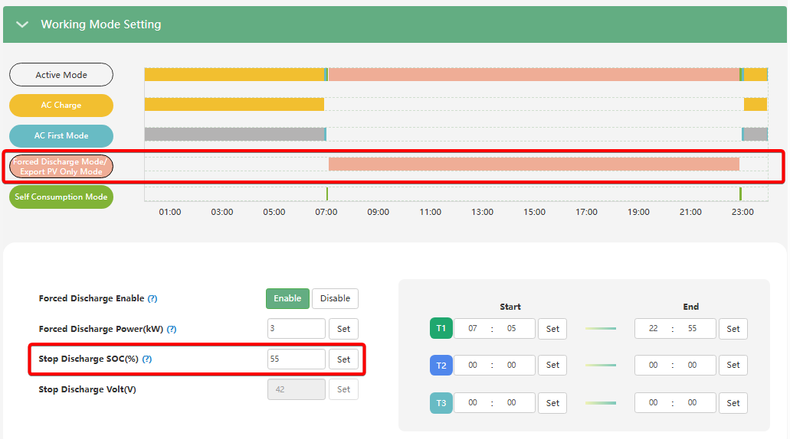

# Stop Discharge SOC (%)

## Призначення

Цей параметр визначає нижній (кінцевий) поріг рівня заряду акумуляторної батареї, при падінні до якого інвертор **зупиняє роботу режиму `Forced Discharge`**.

Коли рівень заряду (або напруга) падає до встановленого вами значення, інвертор негайно припиняє "викачувати" енергію для експорту в загальну мережу, навіть якщо дозволений час (Start/End Time) ще не закінчився. Це гарантує, що після агресивного розряду у вас залишиться гарантований резерв енергії для живлення власного будинку.

## Доступ

| Installer Web | End-User Web | Mobile App | Display (LCD) |
| :-----------: | :----------: | :--------: | :-----------: |
|      ✅       |      ?       |     ?      |       ?       |

> [!Note] З'явилось у прошивці cBaa-338F99 від 2026-01-08.

## Діапазон значень

- **Мінімум:** 0% (або мінімально допустима напруга батареї).
- **Максимум:** 100%.
- **Крок:** 1%.

## Рекомендовані значення

- **Якщо мережа стабільна, і мета — максимальний заробіток:** `20% - 30%`.
- **Якщо можливі блекаути / потрібен резерв:** `40% - 50%`. Це означає, що інвертор продасть енергію за дорожчим тарифом, але зупиниться, зберігши половину ємності акумулятора на випадок, якщо вночі чи зранку зникне світло.

## Примітки та важливі обмеження

> [!WARNING] **Взаємодія з базовим порогом розряду (On-Grid EOD):**
> Досягнення порогу `Stop Discharge SOC` зупиняє **лише експорт з батареї у мережу**. Після цього інвертор виходить з режиму `Forced Discharge` і повертається до свого автономного режиму `Self Consumption`. Якщо ваш базовий поріг переходу на мережу (`On-grid EOD SOC`) встановлено нижче (наприклад, на 15%), інвертор продовжить живити домашні прилади з батареї, поки не дійде до цих 15%.

## Коли змінювати:

Встановлюйте це значення щоразу, коли активуєте примусовий розряд (`Forced Discharge Enable`). Коригуйте відсоток відповідно до сезону та ваших потреб: збільшуйте його взимку або під час нестабільного електропостачання (щоб зберігати більше енергії в АКБ для себе) і зменшуйте, коли хочете максимізувати віддачу в мережу.
